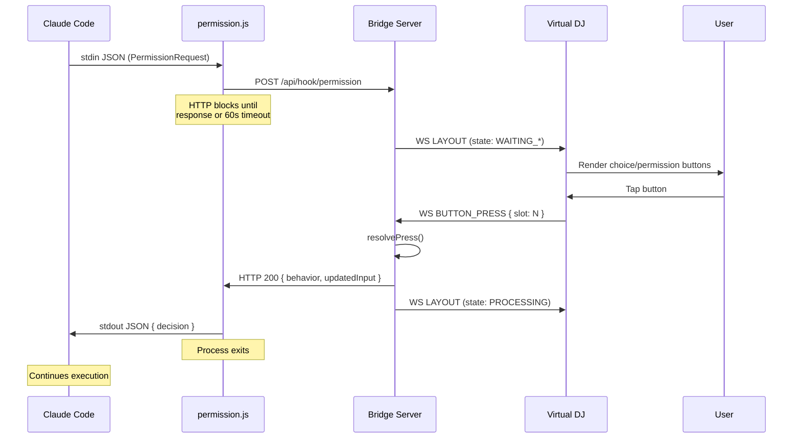
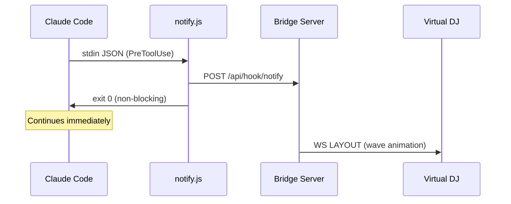
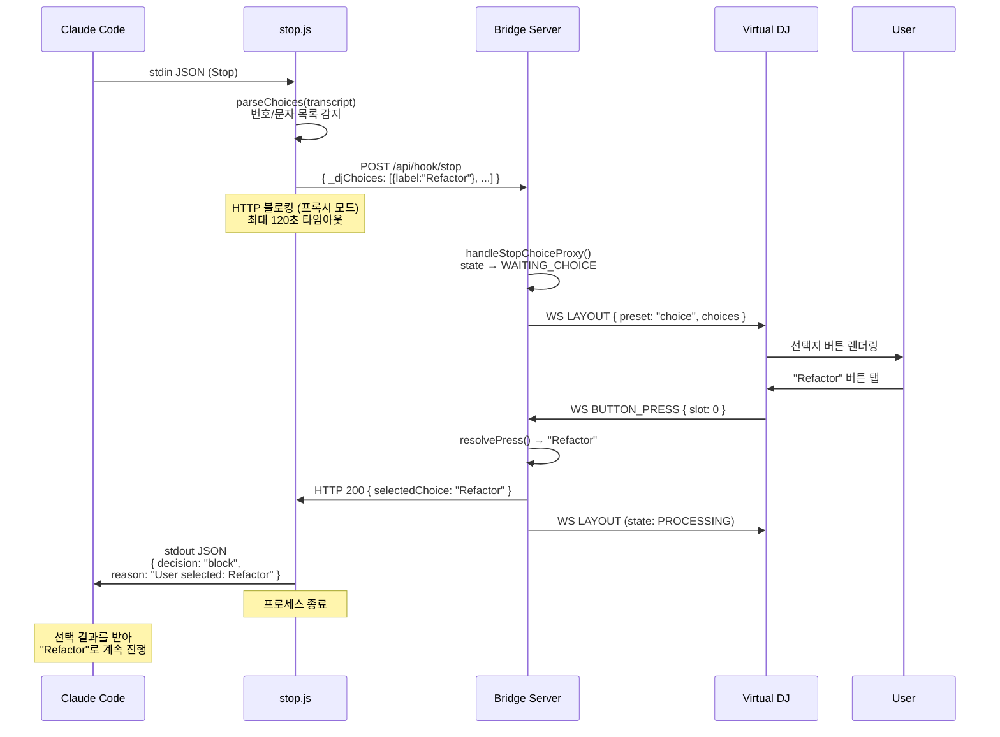
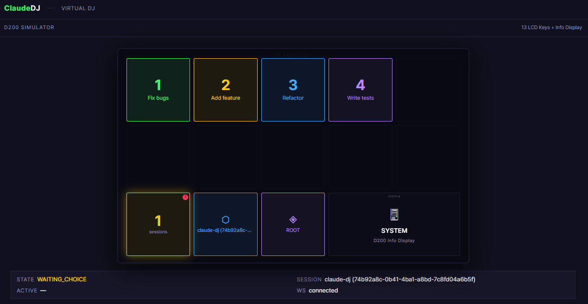
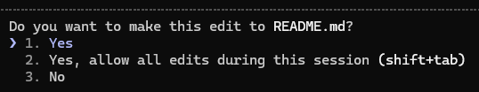
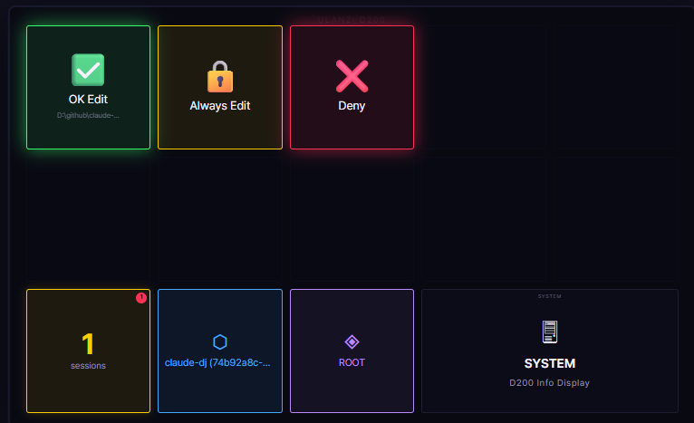

🌐 [English](README.md) | [한국어](README.ko.md) | [中文](README.zh.md)

# Claude DJ

물리적 버튼이나 브라우저로 Claude Code를 제어합니다 — 터미널 포커스 없이도 됩니다.

**[랜딩 페이지](https://whyjp.github.io/claude-dj/)**

## 빠른 시작

### 1. 플러그인 설치

Claude Code 세션에서:

```
/plugin marketplace add https://github.com/whyjp/claude-dj
/plugin install claude-dj-plugin
```

이 한 번의 설치로 **hooks + skills**가 자동으로 등록됩니다.

| 자동 설정 항목 | 상세 내용 |
|----------------|---------|
| **Hooks (17)** | SessionStart/End, PermissionRequest(blocking), PreToolUse/PostToolUse, PostToolUseFailure, Stop/StopFailure, SubagentStart/Stop, UserPromptSubmit, TaskCreated/Completed, PreCompact/PostCompact, TeammateIdle, Notification |
| **Skills (4)** | choice-format (모든 선택지를 AskUserQuestion으로 출력), bridge-start, bridge-stop, bridge-restart |

### 2. Bridge 시작

Bridge는 `SessionStart` hook을 통해 세션이 열릴 때 자동으로 시작됩니다. 수동으로 시작하려면:

```bash
node bridge/server.js                  # http://localhost:39200
./scripts/start-bridge.sh              # 동일, auto-install 포함
./scripts/start-bridge.sh --debug      # + logs/bridge.log에 파일 로깅
```

**http://localhost:39200**을 열어 Virtual DJ 대시보드를 확인하세요.

**Miniview:** 헤더의 `▣` 버튼을 클릭하면 덱이 항상 최상단에 표시되는 미니 창으로 팝아웃됩니다. 또는 `http://localhost:39200?view=mini`를 직접 열어도 됩니다.

### 3. Claude Code 사용

```bash
claude                     # hooks + skills 자동 로드
```

이제 Claude는 모든 권한 대화상자와 선택지를 덱을 통해 처리합니다. 터미널 포커스가 필요 없습니다.

## 로컬 개발

claude-dj 자체 개발 시 `--plugin-dir`을 사용하여 로컬 클론에서 실시간 코드 변경과 함께 플러그인을 로드할 수 있습니다:

```bash
git clone https://github.com/whyjp/claude-dj.git
cd claude-dj
npm install

# Bridge 수동 시작
node claude-plugin/bridge/server.js          # 포그라운드
./scripts/start-bridge.sh                    # auto-install 포함
npm run stop                                 # 실행 중인 bridge 중지

# 로컬 플러그인으로 Claude Code 실행 (marketplace 설치 불필요)
claude --plugin-dir claude-plugin
```

### Bridge 제어

| 명령 | 설명 |
|---------|-------------|
| `npm start` | Bridge 시작 (포그라운드) |
| `npm run stop` | 실행 중인 Bridge 중지 |
| `npm run debug` | 파일 로깅과 함께 시작 |
| `./scripts/start-bridge.sh` | npm auto-install과 함께 시작 |
| `./scripts/stop-bridge.sh` | Bridge 프로세스 찾아 종료 |

## 선택지 처리 방식

Claude DJ는 Claude Code를 터미널 전용 워크플로에서 버튼 기반 인터랙션 모델로 전환합니다. 핵심 혁신은 **skill 주입 선택지 파이프라인**으로, Claude가 결정사항을 제시하는 방식과 사용자가 응답하는 방식을 변경합니다.

### 문제점

기본적으로 Claude Code는 터미널에서 텍스트로 선택지를 제시합니다:

```
Which approach should we take?
1. Refactor the module
2. Rewrite from scratch
3. Patch and move on
```

사용자는 터미널을 찾아 숫자를 입력하고 Enter를 눌러야 합니다. 여러 세션이 동시에 실행 중이라면 지속적인 컨텍스트 전환 오버헤드가 발생합니다.

### 해결책: Skill 주입

Claude DJ는 **`choice-format` skill** (`skills/choice-format/SKILL.md`)을 설치하여 모든 Claude Code 세션에 자동으로 로드합니다. 이 skill의 핵심 전제: **사용자는 버튼 덱을 통해 세션을 제어하며 응답을 타이핑할 수 없습니다.** 모든 사용자 결정은 `AskUserQuestion`을 거쳐야 합니다 — 사용자가 응답할 수 있는 다른 방법은 없습니다.

**이전 (기본 Claude):** Claude가 번호 매긴 목록을 일반 텍스트로 작성하거나 "진행할까요?"라고 질문합니다 — 사용자가 답을 타이핑하길 기대합니다.

**이후 (skill 적용):** Claude가 사용자 응답을 기대하는 메시지를 끝내기 전에 버튼 옵션과 함께 `AskUserQuestion`을 호출합니다. 예외 없이, 텍스트만의 질문도 없습니다.

이것은 단순한 외형적 변경이 아닙니다. `AskUserQuestion`은 `PermissionRequest` hook을 트리거하는 Claude Code 내장 도구입니다 — 파일 쓰기와 셸 명령 승인에 사용되는 것과 동일한 hook 시스템입니다. Claude가 이 도구를 통해 모든 선택지를 라우팅하도록 지시함으로써, 모든 결정이 덱이 물리적 버튼으로 렌더링할 수 있는 **구조화된, 인터셉트 가능한 이벤트**가 됩니다.

### 선택지 파이프라인

```
  Claude Code (model)
       │
       │  Skill injection: "use AskUserQuestion for all choices"
       │
       ▼
  AskUserQuestion tool call
       │  tool_name: "AskUserQuestion"
       │  tool_input: { questions: [{ question, options: ["Refactor", "Rewrite", "Patch"] }] }
       │
       ▼
  PermissionRequest hook ──→ hooks/permission.js ──→ POST /api/hook/permission
       │                                                      │
       │  (HTTP request blocks until                          │
       │   deck button is pressed                             ▼
       │   or 60s timeout)                             Bridge Server
       │                                               SessionManager
       │                                                      │
       │                                               state: WAITING_CHOICE
       │                                               prompt: { type: CHOICE, choices }
       │                                                      │
       │                                                      ▼ WebSocket broadcast
       │                                               ┌─────────────┐
       │                                               │  Virtual DJ │
       │                                               │  (browser)  │
       │                                               │             │
       │                                               │ [Refactor]  │
       │                                               │ [Rewrite ]  │
       │                                               │ [Patch   ]  │
       │                                               └──────┬──────┘
       │                                                      │
       │                                               User presses button
       │                                                      │
       │                                                      ▼
       │                                               BUTTON_PRESS { slot: 0 }
       │                                                      │
       │                                               resolvePress → { answer: "1" }
       │                                                      │
       ◀──────────────────────────────────────────────────────┘
       │  HTTP response:
       │  { decision: { behavior: "allow", updatedInput: { answer: "1" } } }
       │
       ▼
  Claude receives answer "1" → continues with "Refactor the module"
```

### Skill이 변경하는 것

`choice-format` skill은 간단한 3단계 워크플로를 강제합니다:

1. **작성** — 설명, 계획, 분석을 일반 텍스트로 작성합니다
2. **자문** — "사용자의 반응을 기대하고 있는가?"
3. **그렇다면** → 메시지가 끝나기 전에 옵션과 함께 `AskUserQuestion`을 호출합니다

이로써 두 가지 인터랙션 패턴이 만들어집니다:

| 패턴 | 상황 | 옵션 | 예시 |
|------|------|------|------|
| **선택** | 진정으로 다른 2-4개의 경로 | `["Refactor", "Rewrite", "Patch"]` | 문제에 대한 여러 접근법 |
| **확인** | 방금 서술한 계획의 승인/거부 | `["Proceed", "Different approach"]` | 설명 후 계획 승인 |

**제약사항:** 레이블은 최대 30자, 질문당 최대 10개 옵션. 확인은 항상 정확히 2개 옵션. 한국어 세션은 현지화된 레이블을 사용합니다 (예: `["진행", "다른 방향"]`).

**skill이 방지하는 흔한 실수** — 아래 모두 `AskUserQuestion`이 필요하며, 일반 텍스트는 안 됩니다:

| 텍스트 질문 | → AskUserQuestion |
|---|---|
| "shall I proceed?" / "진행할까요?" | `["Proceed", "Different approach"]` |
| "should I commit?" / "커밋할까요?" | `["Commit", "Not yet"]` |
| "which approach?" / "어떤 방향?" | `["Option A", "Option B"]` |
| 번호 매긴 목록 (1. X / 2. Y) | `["X", "Y"]` |

계획 설명은 선택지가 아닙니다 — 계획을 텍스트로 서술한 후 예/아니오로 확인합니다.

### AskUserQuestion을 사용하는 이유

`AskUserQuestion`은 `PermissionRequest` hook을 트리거하는데, 이것이 응답이 도착할 때까지 **Claude의 실행을 블로킹**하는 유일한 hook 타입입니다. 이로써 Claude가 텍스트 선택지를 작성하고 즉시 계속하는 것과 달리, 진정한 일시정지-대기 인터랙션이 생성됩니다.

### 두 가지 선택지 경로

Claude DJ는 두 가지 별개의 선택지 메커니즘을 지원하며, **모두 대화형**입니다:

| 경로 | 트리거 | 상태 | 응답 방법 |
|------|---------|-------|-----------------|
| **AskUserQuestion** (기본) | `tool_name: "AskUserQuestion"`인 `PermissionRequest` hook | `WAITING_CHOICE` | `updatedInput.answer`와 함께 블로킹 HTTP 응답 |
| **Stop hook 프록시** (폴백) | `Stop` hook이 마지막 어시스턴트 메시지에서 번호/문자 목록 감지 | `WAITING_CHOICE` | 블로킹 HTTP 응답 → `decision: "block"` + 사용자 선택 |

**AskUserQuestion 경로**가 기본 메커니즘입니다 — `choice-format` skill이 모든 선택지에 이를 사용하도록 지시합니다. **Stop hook 프록시**는 skill에도 불구하고 Claude가 텍스트로 선택지를 출력할 때(예: 플랜 모드 출력, 서드파티 skill 포맷팅)의 안전망입니다. Stop hook이 regex/fence 파싱으로 선택지를 감지하면 HTTP 요청을 hold한 채 덱에 대화형 버튼을 표시합니다. 사용자가 버튼을 누르면 stop hook이 `decision: "block"`과 선택 결과를 반환하고, Claude가 이를 받아 계속 진행합니다.

### 크로스 세션 포커스 관리

여러 Claude Code 세션이 동시에 실행 중일 때:

- **WAITING_CHOICE/BINARY가 항상 우선** — `getFocusSession()`이 단순히 처리 중인 세션보다 버튼 입력이 필요한 세션을 우선시합니다.
- **포커스 필터링된 브로드캐스트** — 세션 A가 처리 중이고 세션 B가 선택지를 기다리고 있을 때, A의 `PreToolUse`/`PostToolUse` 이벤트는 레이아웃 업데이트를 브로드캐스트하지 않습니다. B의 선택지 버튼은 덱에서 안정적으로 유지됩니다.
- **권한 시 자동 포커스** — 어떤 세션이든 `PermissionRequest`를 발생시키면 즉시 덱 포커스를 가져갑니다.
- **수동 사이클링** — 슬롯 11은 루트 세션 간 사이클링, 슬롯 12는 포커스된 세션 내의 서브에이전트 간 사이클링을 합니다.

### 서브에이전트 추적

Claude Code는 부모의 `session_id`를 공유하는 서브에이전트(Explore, Plan 등)를 생성합니다. Claude DJ는 `SubagentStart`/`SubagentStop` hook을 통해 이를 추적합니다:

```
● api-server (abc123)        PROCESSING
  ├ Explore (agent_7f2a)     PROCESSING
  └ Plan (agent_9c1b)        IDLE
● frontend (def456)          WAITING_CHOICE
```

각 서브에이전트는 독립적인 상태 추적을 가집니다. 서브에이전트의 권한 요청도 세션 수준의 `respondFn`을 사용하므로, 요청이 루트에서 왔든 자식 에이전트에서 왔든 덱 버튼이 작동합니다.

## 아키텍처

### 시스템 다이어그램

```
┌──────────────────────────────────────────────────────────────────────┐
│                        Claude Code Process                           │
│                                                                      │
│  Model ──→ Tool Call ──→ Hook System ──→ hooks/*.js (child process)  │
│    ▲                                         │                       │
│    │                                         │ stdin: JSON event     │
│    │                                         │ stdout: JSON response │
│    │                                         ▼                       │
│    │  ◀── stdout (blocking) ───────── permission.js ────────┐       │
│    │  ◀── exit 0 (fire-and-forget) ── notify.js ────────┐   │       │
│    │                                   stop.js ──────┐   │   │       │
│    │                                   postToolUse ──┤   │   │       │
│    │                                   subagent*.js ─┤   │   │       │
│    │                                   userPrompt.js ┤   │   │       │
│    │                                                 │   │   │       │
└────│─────────────────────────────────────────────────│───│───│───────┘
     │                                                 │   │   │
     │    ┌────────── HTTP (localhost:39200) ──────────┘   │   │
     │    │    POST /api/hook/notify (async) ◀────────────┘   │
     │    │    POST /api/hook/permission (BLOCKING) ◀─────────┘
     │    │    POST /api/hook/stop (async)
     │    │    POST /api/hook/subagent* (async)
     │    │    GET  /api/events/:sid (poll)
     │    ▼
     │  ┌──────────────────────────────────────────────────────┐
     │  │              Bridge Server (Express + WS)            │
     │  │                                                      │
     │  │  SessionManager ──→ state machine, focus, prune      │
     │  │  ButtonManager  ──→ state → layout, resolvePress     │
     │  │  WsServer       ──→ broadcast LAYOUT/ALL_DIM         │
     │  │  Logger         ──→ stdout + logs/bridge.log         │
     │  │                                                      │
     │  │  HTTP response = hookSpecificOutput                  │
     │  │  (permission.js blocks until response or 60s timeout)│
     │  └──────────────────────┬───────────────────────────────┘
     │                         │
     │              WebSocket (ws://localhost:39200/ws)
     │              ┌──────────┴──────────┐
     │              ▼                     ▼
     │  ┌───────────────────┐  ┌─────────────────────────┐
     │  │  Virtual DJ       │  │  Ulanzi Translator      │
     │  │  (Browser)        │  │  Plugin (Phase 3)       │
     │  │                   │  │                         │
     │  │  ← LAYOUT (JSON)  │  │  ← LAYOUT → render PNG  │
     │  │  ← ALL_DIM        │  │  ← ALL_DIM              │
     │  │  ← WELCOME        │  │  → BUTTON_PRESS         │
     │  │  → BUTTON_PRESS   │  │                         │
     │  │  → AGENT_FOCUS    │  │  Bridge WS ↔ Ulanzi WS  │
     │  │  → CLIENT_READY   │  └────────────┬────────────┘
     │  │                   │               │
     │  │  Miniview (PiP)   │    WebSocket (ws://127.0.0.1:3906)
     │  └───────────────────┘    Ulanzi SDK JSON protocol
     │                                       │
     │                           ┌───────────▼───────────┐
     │                           │  UlanziStudio App     │
     │                           │  (host, manages D200) │
     │                           └───────────┬───────────┘
     │                                       │ USB HID
     │                           ┌───────────▼───────────┐
     │                           │  Ulanzi D200 Hardware │
     │                           │  13 LCD keys + encoder│
     │                           └───────────────────────┘
     │
     └── HTTP response flows back through permission.js stdout to Claude
```

### 세그먼트별 프로토콜

| 세그먼트 | 프로토콜 | 전송 | 방향 | 블로킹 여부 |
|---------|----------|-----------|-----------|-----------|
| Claude → Hook | stdin JSON | child process spawn | Claude → Hook script | hook 타입에 따라 다름 |
| Hook → Bridge | HTTP REST | `fetch()` to localhost | Hook script → Bridge | **PermissionRequest: YES** (버튼/타임아웃까지 블로킹) |
| Bridge → Virtual DJ | WebSocket JSON | `ws://localhost:39200/ws` | Bridge → Browser | 아니오 (broadcast) |
| Virtual DJ → Bridge | WebSocket JSON | 동일 연결 | Browser → Bridge | 아니오 (fire-and-forget) |
| Bridge → Ulanzi Plugin | WebSocket JSON | `ws://localhost:39200/ws` | Bridge → Plugin | 아니오 (broadcast) |
| Ulanzi Plugin → Bridge | WebSocket JSON | 동일 연결 | Plugin → Bridge | 아니오 (fire-and-forget) |
| Plugin ↔ UlanziStudio | WebSocket JSON | `ws://127.0.0.1:3906` (Ulanzi SDK) | 양방향 | 아니오 |
| UlanziStudio ↔ D200 | USB HID | proprietary | 양방향 | — |
| Bridge → Claude | HTTP response | Hook→Bridge와 동일 연결 | Bridge → Hook script → stdout → Claude | 블로킹 요청 해소 |

**핵심 경로:** `PermissionRequest` hook이 유일한 **동기** 세그먼트입니다. hook 스크립트(`permission.js`)가 HTTP POST를 만들고 bridge가 응답(버튼 누름)하거나 60초 타임아웃까지 **블로킹**합니다. 다른 모든 hook은 fire-and-forget입니다.

### 시퀀스 다이어그램 — Permission (Blocking)



### 시퀀스 다이어그램 — Notify (Fire-and-Forget)



### 시퀀스 다이어그램 — Stop Hook 프록시 (텍스트 선택지 → 대화형 버튼)

Claude가 `AskUserQuestion`을 호출하지 않고 텍스트로 선택지를 출력하면, stop hook이 이를 감지하고 덱을 통해 대화형 버튼으로 프록시합니다.



**permission 경로와의 핵심 차이:** Stop hook은 `decision: "block"`을 사용하여 Claude의 중단을 막습니다. Claude Code는 차단된 stop을 새로운 사용자 메시지로 취급합니다 — `reason` 필드가 Claude가 읽고 처리하는 입력이 됩니다. 이로써 stop hook이 텍스트 기반 선택지를 대화형 덱 버튼으로 변환하는 **선택지 프록시**가 됩니다.

**선택지 감지:** `choiceParser.js` 모듈이 트랜스크립트의 마지막 어시스턴트 메시지를 스캔합니다:
1. **Fence 선택지** — `[claude-dj-choices]...[/claude-dj-choices]` 블록 (최우선)
2. **Regex 폴백** — 마지막 800자에서 번호(`1. X`) 또는 문자(`A. X`) 목록, 15줄 윈도우 내 클러스터링 (섹션 헤더의 false positive 방지)

**D200 하드웨어 참고:** D200은 bridge에 직접 연결되지 않고 USB로 UlanziStudio 데스크탑 앱에 연결됩니다. 번역 플러그인(Phase 3)이 두 WebSocket 프로토콜을 연결합니다. 자세한 내용은 `docs/todo/d200-integration-architecture.md`를 참고하세요.

### 별도 Bridge 프로세스가 필요한 이유

Claude Code hook은 **단기 child process**입니다 — 각 hook 호출은 `node hooks/permission.js`를 spawn하고, 실행 후 stdout에 쓰고 종료됩니다. WebSocket 연결이나 세션 상태를 유지할 영속적인 프로세스가 없습니다. Bridge가 이 간격을 채웁니다:

| 필요 | Hook 단독 | Bridge |
|------|-----------|--------|
| 덱으로의 영속적 WebSocket | 불가 (각 이벤트 후 종료) | 연결 유지 |
| 이벤트 간 세션 상태 | 불가 (공유 메모리 없음) | SessionManager |
| 멀티 세션 포커스 관리 | 불가 (격리된 프로세스) | getFocusSession() |
| 버튼 누름 → HTTP 응답 매핑 | 불가 (리스너 없음) | respondFn callback |

**MCP 서버로 만들 수 있을까요?** MCP는 서버에서 Claude로 도구를 제공합니다. Bridge는 hook을 통해 Claude로부터 이벤트를 수신합니다 — 데이터 흐름이 반대입니다. 그러나 bridge를 MCP 서버(no-op 도구 포함)로 래핑하면 Claude plugin 시스템을 통한 **자동 시작**이 가능해질 수 있습니다. 이는 잠재적인 Phase 2 개선 사항입니다.

### 플러그인 시스템

```
.claude-plugin/
├─ marketplace.json              배포 메타데이터 (git-subdir → claude-plugin/)
claude-plugin/
├─ plugin.json                   플러그인 메타데이터
├─ hooks/
│  ├─ hooks.json                 17개 hook 정의 (Claude Code가 자동 발견)
│  ├─ sessionStart.js            SessionStart → bridge 자동 시작 + 대시보드 URL 표시
│  ├─ sessionEnd.js              SessionEnd → bridge에 알림 (async)
│  ├─ boot-bridge.js             Bridge 부트스트랩: 의존성 설치, detached spawn
│  ├─ permission.js              PermissionRequest → HTTP POST (blocking)
│  ├─ notify.js                  PreToolUse → HTTP POST (async)
│  ├─ postToolUse.js             PostToolUse → HTTP POST (async)
│  ├─ postToolUseFailure.js      PostToolUseFailure → HTTP POST (async)
│  ├─ stop.js                    Stop → 선택지 프록시 (blocking) 또는 async 알림
│  ├─ stopFailure.js             StopFailure → HTTP POST (async)
│  ├─ choiceParser.js            Stop hook 공유 선택지 파싱 로직
│  ├─ subagentStart.js           SubagentStart → HTTP POST (async)
│  ├─ subagentStop.js            SubagentStop → HTTP POST (async)
│  ├─ userPrompt.js              UserPromptSubmit → GET events (poll)
│  ├─ taskCreated.js             TaskCreated/TaskCompleted → HTTP POST (async)
│  ├─ compact.js                 PreCompact/PostCompact → HTTP POST (async)
│  ├─ teammateIdle.js            TeammateIdle → HTTP POST (async)
│  └─ notification.js            Notification → HTTP POST (async)
└─ skills/
   ├─ choice-format/SKILL.md     Claude에 주입: "모든 선택지에 AskUserQuestion 사용"
   ├─ bridge-start/SKILL.md      Bridge 수동 시작
   ├─ bridge-stop/SKILL.md       실행 중인 Bridge 중지
   └─ bridge-restart/SKILL.md    Bridge 재시작 (중지 + 시작)
```

## 덱 레이아웃

```
Row 0: [0] [1] [2] [3] [4]       ← Dynamic: choices or approve/deny
Row 1: [5] [6] [7] [8] [9]       ← Dynamic: choices (up to 10 total)
Row 2: [10:count] [11:session] [12:agent] [Info Display]
```

| 상태 | 슬롯 0-9 | 슬롯 11 | 슬롯 12 |
|-------|-----------|---------|---------|
| IDLE | 어둡게 | 세션 이름 | ROOT |
| PROCESSING | 웨이브 펄스 | 세션 이름 | 에이전트 타입 또는 ROOT |
| WAITING_BINARY | 0=Approve, 1=Always/Deny, 2=Deny | 세션 이름 | 에이전트 타입 또는 ROOT |
| WAITING_CHOICE | 0..N = 선택지 버튼 | 세션 이름 | 에이전트 타입 또는 ROOT |
| WAITING_CHOICE (multiSelect) | ☐/☑ 토글 (0-8) + ✔ Done (9) | 세션 이름 | 에이전트 타입 또는 ROOT |
| WAITING_RESPONSE | ⏳ 입력 대기 중 (선택지 감지 시 choice_hint) | 세션 이름 | 에이전트 타입 또는 ROOT |

## 기능

- **Skill 주입 선택지 파이프라인** — Claude가 모든 결정에 `AskUserQuestion`을 사용하여 버튼 기반 인터랙션을 가능하게 합니다


- **권한 버튼** — Approve / Always Allow / Deny가 덱 슬롯에 매핑됩니다





- **멀티 선택 토글+제출** — `multiSelect` 질문은 ☐/☑ 토글 버튼 (슬롯 0-8) + ✔ Done (슬롯 9)을 표시하며, 실시간 검증됩니다
- **크로스 세션 포커스** — WAITING_CHOICE/BINARY 세션이 자동 우선시되며, 처리 이벤트가 필터링됩니다
- **서브에이전트 추적** — 트리 뷰 표시, 에이전트별 독립 상태, 슬롯 12 사이클링
- **Stop hook 선택지 프록시** — Claude가 `AskUserQuestion` 없이 텍스트 선택지를 출력하면, stop hook이 이를 감지하고 `decision: "block"` 프록시를 통해 대화형 덱 버튼을 생성합니다
- **Choice hint 표시** — 프록시를 사용할 수 없을 때 감지된 선택지의 시각적 폴백 표시
- **멀티 세션 관리** — 슬롯 11이 루트 세션을 사이클링하고, 권한 시 자동 포커스 전환
- **Late-join 동기화** — 새 클라이언트가 현재 덱 상태를 즉시 수신합니다
- **Miniview 모드** — 덱을 항상 최상단 PiP 창으로 팝아웃 (`▣` 버튼 또는 `?view=mini`), 루트/서브에이전트 전환을 위한 에이전트 탭 바 포함
- **플러그인 패키징** — 이동 가능한 `${CLAUDE_PLUGIN_ROOT}` 경로를 사용하는 `.claude-plugin/plugin.json`
- **Bridge 자동 시작** — SessionStart hook이 실행 중이 아니면 bridge를 spawn하고 대시보드 URL을 표시합니다
- **Bridge 버전 불일치 자동 재시작** — 플러그인 업데이트 후 오래된 bridge를 감지하고 새 버전으로 재시작
- **Bridge 슬래시 커맨드** — `/bridge-start`, `/bridge-stop`, `/bridge-restart` skill로 수동 bridge 제어
- **Bridge 자동 종료** — 세션이나 클라이언트가 없으면 5분 후 정상 종료
- **도구 오류 빨간 펄스** — 도구 오류(`PostToolUseFailure`, `StopFailure`)가 슬롯 0-9에 빨간 펄스로 표시
- **세션 자동 정리** — 유휴 세션이 5분 후 정리됩니다
- **스마트 세션 이름** — 디스크 PID 파일에서 세션 이름 확인, 인덱스 기본값 (`session[0]`, `session[1]`, ...)
- **네이티브 권한 규칙** — hook 응답의 `updatedPermissions`로 영구적 허용/거부 규칙
- **작업 & 컴팩트 추적** — TaskCreated/Completed, PreCompact/PostCompact hook이 bridge에 로깅
- **디버그 로깅** — `--debug` 플래그로 구조화된 레벨(INFO/WARN/ERROR)과 함께 `logs/bridge.log`에 파일 로깅 활성화

## 설정

| 환경 변수 | 기본값 | 설명 |
|---------------------|---------|-------------|
| `CLAUDE_DJ_PORT` | `39200` | Bridge 서버 포트 |
| `CLAUDE_DJ_URL` | `http://localhost:39200` | Hook → Bridge URL |
| `CLAUDE_DJ_BUTTON_TIMEOUT` | `60000` (60초) | 권한 버튼 타임아웃 (ms) |
| `CLAUDE_DJ_IDLE_TIMEOUT` | `300000` (5분) | 세션 정리 타임아웃 (ms) |
| `CLAUDE_DJ_SHUTDOWN_TICKS` | `10` (5분) | 자동 종료 전 빈 틱 수 (×30초) |
| `CLAUDE_DJ_DEBUG` | off | 파일 로깅 활성화하려면 `1`로 설정 |

## 디버깅

```bash
# 파일 로깅과 함께 시작
./scripts/start-bridge.sh --debug       # Linux/macOS
scripts\start-bridge.bat --debug        # Windows
npm run debug                           # npm을 통해

# 로그 파일 위치는 시작 시 출력됩니다:
#   [claude-dj] Log file: D:\github\claude-dj\logs\bridge.log

# 문제만 필터링 (WARN = dropped/ignored, ERROR = failures)
grep -E "WARN|ERROR" logs/bridge.log

# 버튼 누름 엔드투엔드 추적
grep "slot=0" logs/bridge.log
```

로그 레벨:
| 레벨 | 의미 | 예시 |
|-------|---------|---------|
| `INFO` | 정상 흐름 | `[ws] BUTTON_PRESS slot=0`, `[hook→claude] behavior=allow` |
| `WARN` | 버튼 dropped/ignored | `[btn] dropped — no focused session`, `TIMEOUT` |
| `ERROR` | 문제 발생 | `[hook→claude] FAILED res.json`, `respondFn threw` |

## 개발

```bash
npm install                            # 의존성 설치
npm test                               # 모든 테스트 실행 (223)
node claude-plugin/bridge/server.js    # bridge 시작
npm run debug                          # 파일 로깅과 함께 bridge 시작
npm run stop                           # 실행 중인 bridge 중지
```

## 라이선스

MIT
