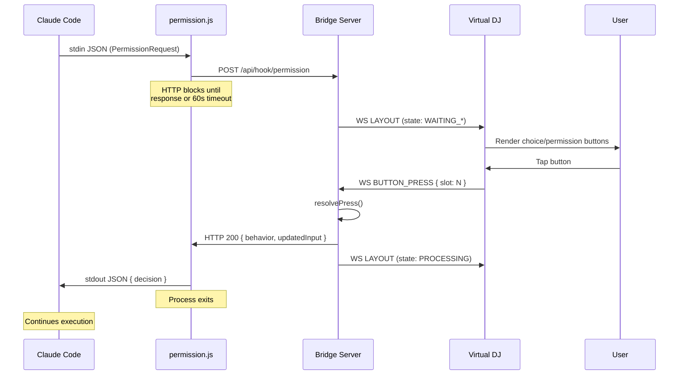
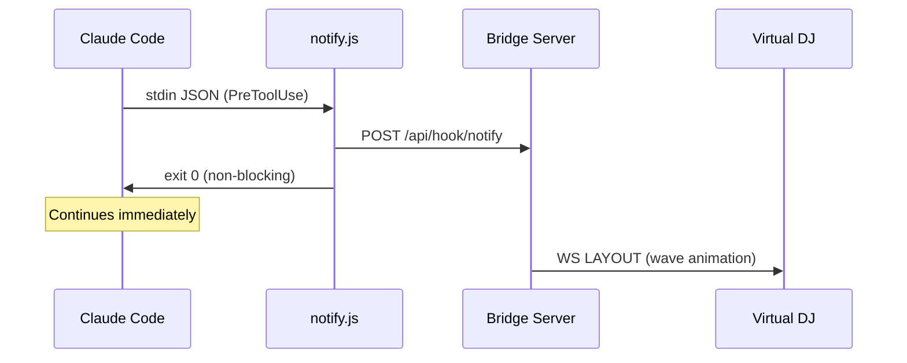
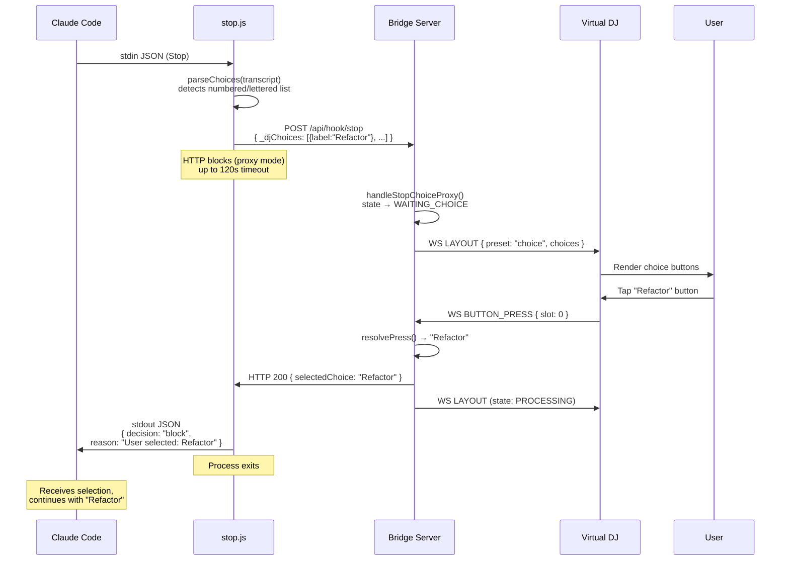

🌐 [English](README.md) | [한국어](README.ko.md) | [中文](README.zh.md)

# Claude DJ

Control Claude Code with physical buttons or browser — no terminal focus needed.

**[Landing Page](https://whyjp.github.io/claude-dj/)**

## Quick Start

### 1. Install Plugin

In a Claude Code session:

```
/plugin marketplace add https://github.com/whyjp/claude-dj
/plugin install claude-dj-plugin
```

This single install registers **hooks + skills** automatically.

| Auto-configured | Details |
|----------------|---------|
| **Hooks (17)** | SessionStart/End, PermissionRequest(blocking), PreToolUse/PostToolUse, PostToolUseFailure, Stop/StopFailure, SubagentStart/Stop, UserPromptSubmit, TaskCreated/Completed, PreCompact/PostCompact, TeammateIdle, Notification |
| **Skills (5)** | choice-format (AskUserQuestion for all choices), bridge-start, bridge-stop, bridge-restart, dj-test (D200H feature test harness) |

### 2. Start the Bridge

The bridge auto-starts on session open via the `SessionStart` hook. To start manually:

```bash
node bridge/server.js                  # http://localhost:39200
./scripts/start-bridge.sh              # same, with auto-install
./scripts/start-bridge.sh --debug      # + file logging to logs/bridge.log
```

Open **http://localhost:39200** to see the Virtual DJ dashboard.

**Miniview:** Click `▣` in the header to pop out the deck as an always-on-top mini window. Or open `http://localhost:39200?view=mini` directly.

### 3. Use Claude Code

```bash
claude                     # hooks + skills auto-loaded
```

Claude now uses the deck for all permission dialogs and choice selections. No terminal focus needed.

## Local Development

For developing on claude-dj itself, use `--plugin-dir` to load the plugin from your local clone with live code changes:

```bash
git clone https://github.com/whyjp/claude-dj.git
cd claude-dj
npm install

# Start bridge manually
node claude-plugin/bridge/server.js          # foreground
./scripts/start-bridge.sh                    # with auto-install
npm run stop                                 # stop running bridge

# Run Claude Code with local plugin (no marketplace install needed)
claude --plugin-dir claude-plugin
```

### Bridge Control

| Command | Description |
|---------|-------------|
| `npm start` | Start bridge (foreground) |
| `npm run stop` | Stop running bridge |
| `npm run debug` | Start with file logging |
| `./scripts/start-bridge.sh` | Start with auto npm install |
| `./scripts/stop-bridge.sh` | Find and kill bridge process |

## How Choice Processing Works

Claude DJ transforms Claude Code from a terminal-only workflow into a button-driven interaction model. The core innovation is a **skill-injected choice pipeline** that changes how Claude presents decisions and how users respond.

### The Problem

By default, Claude Code presents choices as text in the terminal:

```
Which approach should we take?
1. Refactor the module
2. Rewrite from scratch
3. Patch and move on
```

The user must find the terminal, type a number, and press Enter. With multiple sessions running, this creates constant context-switching overhead.

### The Solution: Skill Injection

Claude DJ installs a **`choice-format` skill** (`skills/choice-format/SKILL.md`) that is automatically loaded into every Claude Code session. The skill's core premise: **the user controls the session via a button deck and cannot type responses.** Every user decision must go through `AskUserQuestion` — there is no other way for the user to respond.

**Before (default Claude):** Claude writes numbered lists as plain text or asks "shall I proceed?" — expecting the user to type a reply.

**After (with skill):** Claude calls `AskUserQuestion` with button options before ending any message that expects a response. No exceptions, no text-only questions.

This is not a cosmetic change. `AskUserQuestion` is a Claude Code built-in tool that triggers the `PermissionRequest` hook — the same hook system used for file write and shell command approvals. By instructing Claude to route all choices through this tool, every decision becomes a **structured, interceptable event** that the deck can render as physical buttons.

### Choice Pipeline

```
  Claude Code (model)
       │
       │  Skill injection: "use AskUserQuestion for all choices"
       │
       ▼
  AskUserQuestion tool call
       │  tool_name: "AskUserQuestion"
       │  tool_input: { questions: [{ question, options: ["Refactor", "Rewrite", "Patch"] }] }
       │
       ▼
  PermissionRequest hook ──→ hooks/permission.js ──→ POST /api/hook/permission
       │                                                      │
       │  (HTTP request blocks until                          │
       │   deck button is pressed                             ▼
       │   or 60s timeout)                             Bridge Server
       │                                               SessionManager
       │                                                      │
       │                                               state: WAITING_CHOICE
       │                                               prompt: { type: CHOICE, choices }
       │                                                      │
       │                                                      ▼ WebSocket broadcast
       │                                               ┌─────────────┐
       │                                               │  Virtual DJ │
       │                                               │  (browser)  │
       │                                               │             │
       │                                               │ [Refactor]  │
       │                                               │ [Rewrite ]  │
       │                                               │ [Patch   ]  │
       │                                               └──────┬──────┘
       │                                                      │
       │                                               User presses button
       │                                                      │
       │                                                      ▼
       │                                               BUTTON_PRESS { slot: 0 }
       │                                                      │
       │                                               resolvePress → { answer: "1" }
       │                                                      │
       ◀──────────────────────────────────────────────────────┘
       │  HTTP response:
       │  { decision: { behavior: "allow", updatedInput: { answer: "1" } } }
       │
       ▼
  Claude receives answer "1" → continues with "Refactor the module"
```

### What the Skill Changes

The `choice-format` skill enforces a simple 3-step workflow:

1. **Write** your explanation, plan, or analysis as normal text
2. **Ask yourself**: "Am I expecting the user to react?"
3. **If yes** → call `AskUserQuestion` with options before the message ends

This produces two interaction patterns:

| Pattern | When | Options | Example |
|---------|------|---------|---------|
| **Choice** | 2-4 genuinely different paths | `["Refactor", "Rewrite", "Patch"]` | Multiple approaches to a problem |
| **Confirmation** | Approve/reject a plan just stated | `["Proceed", "Different approach"]` | Plan approval after explanation |

**Constraints:** Labels max 30 chars, max 10 options per question. Confirmations always exactly 2 options. Korean sessions use localized labels (e.g. `["진행", "다른 방향"]`).

**Common mistakes the skill prevents** — these ALL require `AskUserQuestion`, never bare text:

| Text question | → AskUserQuestion |
|---|---|
| "shall I proceed?" / "진행할까요?" | `["Proceed", "Different approach"]` |
| "should I commit?" / "커밋할까요?" | `["Commit", "Not yet"]` |
| "which approach?" / "어떤 방향?" | `["Option A", "Option B"]` |
| Numbered lists (1. X / 2. Y) | `["X", "Y"]` |

Plan descriptions are not choices — state the plan as text, then confirm with yes/no.

### Why AskUserQuestion?

`AskUserQuestion` triggers a `PermissionRequest` hook, which is the only hook type that **blocks Claude's execution** until a response arrives. This creates a true pause-and-wait interaction, unlike text choices which Claude writes and immediately continues.

### Two Choice Paths

Claude DJ supports two distinct choice mechanisms, **both interactive**:

| Path | Trigger | State | Response Method |
|------|---------|-------|-----------------|
| **AskUserQuestion** (primary) | `PermissionRequest` hook with `tool_name: "AskUserQuestion"` | `WAITING_CHOICE` | Blocking HTTP response with `updatedInput.answer` |
| **Stop hook proxy** (fallback) | `Stop` hook parses last assistant message for numbered/lettered lists | `WAITING_CHOICE` | Blocking HTTP response → `decision: "block"` with user selection |

The **AskUserQuestion path** is the primary mechanism — the `choice-format` skill instructs Claude to use it for all choices. The **stop hook proxy** is the safety net for when Claude writes choices as text despite the skill (e.g. plan mode outputs, third-party skill formatting). The stop hook detects choices via regex/fence parsing, then holds the HTTP request open while the deck displays interactive buttons. When the user presses a button, the stop hook returns `decision: "block"` with the selection, which Claude receives and continues with.

### Cross-Session Focus Management

When multiple Claude Code sessions are running simultaneously:

- **WAITING_CHOICE/BINARY always wins** — `getFocusSession()` prioritizes sessions needing button input over sessions that are just processing.
- **Focus-filtered broadcasts** — When session A is processing and session B is waiting for a choice, A's `PreToolUse`/`PostToolUse` events do NOT broadcast layout updates. B's choice buttons remain stable on the deck.
- **Auto-focus on permission** — When any session fires a `PermissionRequest`, it immediately takes deck focus.
- **Manual cycling** — Slot 11 cycles between root sessions. Slot 12 cycles between subagents within the focused session.

### Subagent Tracking

Claude Code spawns subagents (Explore, Plan, etc.) that share the parent's `session_id`. Claude DJ tracks these via `SubagentStart`/`SubagentStop` hooks:

```
● api-server (abc123)        PROCESSING
  ├ Explore (agent_7f2a)     PROCESSING
  └ Plan (agent_9c1b)        IDLE
● frontend (def456)          WAITING_CHOICE
```

Each subagent has independent state tracking. Permission requests from subagents still use the session-level `respondFn`, so deck buttons work regardless of whether the request came from root or a child agent.

## Architecture

### System Diagram

```
┌──────────────────────────────────────────────────────────────────────┐
│                        Claude Code Process                           │
│                                                                      │
│  Model ──→ Tool Call ──→ Hook System ──→ hooks/*.js (child process)  │
│    ▲                                         │                       │
│    │                                         │ stdin: JSON event     │
│    │                                         │ stdout: JSON response │
│    │                                         ▼                       │
│    │  ◀── stdout (blocking) ───────── permission.js ────────┐       │
│    │  ◀── exit 0 (fire-and-forget) ── notify.js ────────┐   │       │
│    │                                   stop.js ──────┐   │   │       │
│    │                                   postToolUse ──┤   │   │       │
│    │                                   subagent*.js ─┤   │   │       │
│    │                                   userPrompt.js ┤   │   │       │
│    │                                                 │   │   │       │
└────│─────────────────────────────────────────────────│───│───│───────┘
     │                                                 │   │   │
     │    ┌────────── HTTP (localhost:39200) ──────────┘   │   │
     │    │    POST /api/hook/notify (async) ◀────────────┘   │
     │    │    POST /api/hook/permission (BLOCKING) ◀─────────┘
     │    │    POST /api/hook/stop (async)
     │    │    POST /api/hook/subagent* (async)
     │    │    GET  /api/events/:sid (poll)
     │    ▼
     │  ┌──────────────────────────────────────────────────────┐
     │  │              Bridge Server (Express + WS)            │
     │  │                                                      │
     │  │  SessionManager ──→ state machine, focus, prune      │
     │  │  ButtonManager  ──→ state → layout, resolvePress     │
     │  │  WsServer       ──→ broadcast LAYOUT/ALL_DIM         │
     │  │  Logger         ──→ stdout + logs/bridge.log         │
     │  │                                                      │
     │  │  HTTP response = hookSpecificOutput                  │
     │  │  (permission.js blocks until response or 60s timeout)│
     │  └──────────────────────┬───────────────────────────────┘
     │                         │
     │              WebSocket (ws://localhost:39200/ws)
     │              ┌──────────┴──────────┐
     │              ▼                     ▼
     │  ┌───────────────────┐  ┌─────────────────────────┐
     │  │  Virtual DJ       │  │  Ulanzi Translator      │
     │  │  (Browser)        │  │  Plugin                 │
     │  │                   │  │                         │
     │  │  ← LAYOUT (JSON)  │  │  ← LAYOUT → render PNG  │
     │  │  ← ALL_DIM        │  │  ← ALL_DIM              │
     │  │  ← WELCOME        │  │  → BUTTON_PRESS         │
     │  │  → BUTTON_PRESS   │  │                         │
     │  │  → AGENT_FOCUS    │  │  Bridge WS ↔ Ulanzi WS  │
     │  │  → CLIENT_READY   │  └────────────┬────────────┘
     │  │                   │               │
     │  │  Miniview (PiP)   │    WebSocket (ws://127.0.0.1:3906)
     │  └───────────────────┘    Ulanzi SDK JSON protocol
     │                                       │
     │                           ┌───────────▼───────────┐
     │                           │  UlanziStudio App     │
     │                           │  (host, manages D200H)│
     │                           └───────────┬───────────┘
     │                                       │ USB HID
     │                           ┌───────────▼───────────┐
     │                           │  Ulanzi D200H         │
     │                           │  20 LCD keys (5×4)    │
     │                           └───────────────────────┘
     │
     └── HTTP response flows back through permission.js stdout to Claude
```

### Protocol by Segment

| Segment | Protocol | Transport | Direction | Blocking? |
|---------|----------|-----------|-----------|-----------|
| Claude → Hook | stdin JSON | child process spawn | Claude → Hook script | depends on hook type |
| Hook → Bridge | HTTP REST | `fetch()` to localhost | Hook script → Bridge | **PermissionRequest: YES** (blocks until button/timeout) |
| Bridge → Virtual DJ | WebSocket JSON | `ws://localhost:39200/ws` | Bridge → Browser | no (broadcast) |
| Virtual DJ → Bridge | WebSocket JSON | same connection | Browser → Bridge | no (fire-and-forget) |
| Bridge → Ulanzi Translator | WebSocket JSON | `ws://localhost:39200/ws` | Bridge → Plugin | no (broadcast) |
| Ulanzi Translator → Bridge | WebSocket JSON | same connection | Plugin → Bridge | no (fire-and-forget) |
| Translator ↔ UlanziStudio | WebSocket JSON | `ws://127.0.0.1:3906` (Ulanzi SDK) | bidirectional | no |
| UlanziStudio ↔ D200H | USB HID | proprietary | bidirectional | — |
| Bridge → Claude | HTTP response | same connection as Hook→Bridge | Bridge → Hook script → stdout → Claude | resolves the blocking request |

**The critical path:** `PermissionRequest` hook is the only **synchronous** segment. The hook script (`permission.js`) makes an HTTP POST and **blocks** until the bridge responds (button pressed) or 60s timeout. All other hooks are fire-and-forget.

### Sequence Diagram — Permission (Blocking)



### Sequence Diagram — Notify (Fire-and-Forget)



### Sequence Diagram — Stop Hook Proxy (Text Choices → Interactive Buttons)

When Claude outputs choices as text without calling `AskUserQuestion`, the stop hook detects them and proxies them through the deck as interactive buttons.



**Key difference from the permission path:** The stop hook uses `decision: "block"` to prevent Claude from stopping. Claude Code treats blocked stops as a new user message — the `reason` field becomes input that Claude reads and acts on. This effectively turns the stop hook into a **choice proxy** that converts text-based choices into interactive deck buttons.

**Choice detection:** The `choiceParser.js` module scans the last assistant message in the transcript for:
1. **Fenced choices** — `[claude-dj-choices]...[/claude-dj-choices]` blocks (highest priority)
2. **Regex fallback** — Numbered (`1. X`) or lettered (`A. X`) lists in the last 800 characters, clustered within a 15-line window (avoids false positives from section headers)
3. **Explanation filter** (regex fallback only) — In the regex fallback path, lists containing em-dash (`—`), en-dash (`–`), or arrow (`→`) separators are recognized as explanatory text and skipped (e.g. `"1. Cache — stale"` is filtered). This does NOT affect the AskUserQuestion path — choices sent via the tool are always displayed regardless of content.

**D200H hardware note:** The D200H connects via USB to the UlanziStudio desktop app, not directly to the bridge. The translator plugin (`ulanzi/com.claudedj.deck.ulanziPlugin`) bridges the two WebSocket protocols — converting row-major Bridge slots to column-major UlanziStudio slots and rendering dynamic icons as 72×72 PNG bitmaps. See `ulanzi/com.claudedj.deck.ulanziPlugin/README.md` for setup and development.

### Why a Separate Bridge Process?

Claude Code hooks are **short-lived child processes** — each hook invocation spawns `node hooks/permission.js`, which runs, writes stdout, and exits. There is no persistent process to hold WebSocket connections or session state. The bridge fills this gap:

| Need | Hook alone | Bridge |
|------|-----------|--------|
| Persistent WebSocket to deck | cannot (exits after each event) | holds connections |
| Session state across events | cannot (no shared memory) | SessionManager |
| Multi-session focus management | cannot (isolated processes) | getFocusSession() |
| Button press → HTTP response mapping | cannot (no listener) | respondFn callback |

**Could this be an MCP server?** MCP provides tools FROM a server TO Claude. The bridge receives events FROM Claude via hooks — the data flow is reversed. However, wrapping the bridge as an MCP server (with a no-op tool) could enable **auto-start** via Claude plugin system. This is a potential Phase 2 improvement.

### Plugin System

```
.claude-plugin/
├─ marketplace.json              Distribution metadata (git-subdir → claude-plugin/)
claude-plugin/
├─ plugin.json                   Plugin metadata
├─ hooks/
│  ├─ hooks.json                 17 hook definitions (auto-discovered by Claude Code)
│  ├─ sessionStart.js            SessionStart → auto-start bridge + display dashboard URL
│  ├─ sessionEnd.js              SessionEnd → notify bridge (async)
│  ├─ boot-bridge.js             Bridge bootstrap: install deps, spawn detached
│  ├─ permission.js              PermissionRequest → HTTP POST (blocking)
│  ├─ notify.js                  PreToolUse → HTTP POST (async)
│  ├─ postToolUse.js             PostToolUse → HTTP POST (async)
│  ├─ postToolUseFailure.js      PostToolUseFailure → HTTP POST (async)
│  ├─ stop.js                    Stop → choice proxy (blocking) or async notify
│  ├─ stopFailure.js             StopFailure → HTTP POST (async)
│  ├─ choiceParser.js            Shared choice-parsing logic for stop hooks
│  ├─ hookLogger.js              File logger for hooks (logs/hooks.log, 1MB rotation)
│  ├─ subagentStart.js           SubagentStart → HTTP POST (async)
│  ├─ subagentStop.js            SubagentStop → HTTP POST (async)
│  ├─ userPrompt.js              UserPromptSubmit → GET events (poll)
│  ├─ taskCreated.js             TaskCreated/TaskCompleted → HTTP POST (async)
│  ├─ compact.js                 PreCompact/PostCompact → HTTP POST (async)
│  ├─ teammateIdle.js            TeammateIdle → HTTP POST (async)
│  └─ notification.js            Notification → HTTP POST (async)
└─ skills/
   ├─ choice-format/SKILL.md     Injected into Claude: "use AskUserQuestion for all choices"
   ├─ bridge-start/SKILL.md      Start the bridge manually
   ├─ bridge-stop/SKILL.md       Stop the running bridge
   ├─ bridge-restart/SKILL.md    Restart the bridge (stop + start)
   └─ dj-test/SKILL.md           Sequential D200H feature test harness
```

## Deck Layout

```
Row 0: [0] [1] [2] [3] [4]       ← Dynamic: choices or approve/deny
Row 1: [5] [6] [7] [8] [9]       ← Dynamic: choices (up to 10 total)
Row 2: [10:count] [11:session] [12:agent] [Info Display]
```

| State | Slots 0-9 | Slot 11 | Slot 12 |
|-------|-----------|---------|---------|
| IDLE | Dim | Session name | ROOT |
| PROCESSING | Wave pulse | Session name | Agent type or ROOT |
| WAITING_BINARY | 0=Approve, 1=Always/Deny, 2=Deny | Session name | Agent type or ROOT |
| WAITING_CHOICE | 0..N = choice buttons | Session name | Agent type or ROOT |
| WAITING_CHOICE (multiSelect) | ☐/☑ toggle (0-8) + ✔ Done (9) | Session name | Agent type or ROOT |
| WAITING_RESPONSE | ⏳ Awaiting input (choice_hint if choices detected) | Session name | Agent type or ROOT |

## Features

- **Skill-injected choice pipeline** — Claude uses `AskUserQuestion` for all decisions, enabling button-driven interaction


- **Permission buttons** — Approve / Always Allow / Deny mapped to deck slots


- **Multi-select toggle+submit** — `multiSelect` questions show ☐/☑ toggle buttons (slots 0-8) + ✔ Done (slot 9), live verified
- **Cross-session focus** — WAITING_CHOICE/BINARY sessions auto-prioritized, processing events filtered
- **Subagent tracking** — Tree-view display, independent state per agent, slot 12 cycling
- **Stop hook choice proxy** — When Claude outputs text choices without `AskUserQuestion`, the stop hook detects them and creates interactive deck buttons via `decision: "block"` proxy
- **Choice hint display** — Fallback visual indicator when choices are detected but proxy is unavailable
- **Multi-session management** — Slot 11 cycles root sessions, focus auto-switches on permission
- **Late-join sync** — New clients receive current deck state immediately
- **Miniview mode** — Pop-out deck as always-on-top PiP window (`▣` button or `?view=mini`), with agent tab bar for root/subagent switching
- **Plugin packaging** — `.claude-plugin/plugin.json` with portable `${CLAUDE_PLUGIN_ROOT}` paths
- **Bridge auto-start** — SessionStart hook spawns the bridge if not running, displays dashboard URL
- **Bridge version-mismatch auto-restart** — After plugin update, detects stale bridge and restarts with the new version
- **Bridge slash commands** — `/bridge-start`, `/bridge-stop`, `/bridge-restart` skills for manual bridge control
- **Bridge auto-shutdown** — Graceful shutdown after 5 minutes with no sessions or clients
- **Tool error red pulse** — Tool errors (`PostToolUseFailure`, `StopFailure`) display as red pulse on slots 0-9
- **Session auto-cleanup** — Idle sessions pruned after 5 minutes
- **Smart session naming** — Session names resolved from disk PID files, indexed defaults (`session[0]`, `session[1]`, ...)
- **Native permission rules** — `updatedPermissions` in hook responses for persistent allow/deny rules
- **Explanation filter** — Numbered lists with `—`/`–`/`→` separators are recognized as explanatory text and excluded from choice detection, preventing false-positive buttons
- **Debug API** — `GET /api/deck-state` returns current deck layout as JSON; `GET /api/logs?n=50` returns recent bridge log entries from in-memory ring buffer (200 entries)
- **Local debug deploy** — `node scripts/local-deploy.js` copies changed files to ALL cached plugin versions (works around `CLAUDE_PLUGIN_ROOT` pointing to unexpected cache versions)
- **Task & compact tracking** — TaskCreated/Completed, PreCompact/PostCompact hooks logged to bridge
- **Always-on file logging** — Bridge (`logs/bridge.log`, 2MB), hooks (`logs/hooks.log`, 1MB), and Ulanzi plugin (`logs/ulanzi-plugin.log`, 1MB) all log to files with auto-rotation. `CLAUDE_DJ_DEBUG=1` adds verbose console output.

## Configuration

| Environment Variable | Default | Description |
|---------------------|---------|-------------|
| `CLAUDE_DJ_PORT` | `39200` | Bridge server port |
| `CLAUDE_DJ_URL` | `http://localhost:39200` | Hook → Bridge URL |
| `CLAUDE_DJ_BUTTON_TIMEOUT` | `60000` (60s) | Permission button timeout (ms) |
| `CLAUDE_DJ_IDLE_TIMEOUT` | `300000` (5min) | Session prune timeout (ms) |
| `CLAUDE_DJ_SHUTDOWN_TICKS` | `10` (5min) | Empty ticks (×30s) before auto-shutdown |
| `CLAUDE_DJ_DEBUG` | off | Set `1` for verbose console output (file logging is always on) |

## Debugging

### Log Files (always-on)

File logging is enabled by default with auto-rotation:

| Component | Log file | Max size | Contents |
|-----------|----------|----------|----------|
| Bridge | `logs/bridge.log` | 2MB | All hook events, button presses, WebSocket activity |
| Hooks | `logs/hooks.log` | 1MB | Permission/stop hook inputs, responses, errors |
| Ulanzi plugin | `(plugin dir)/logs/ulanzi-plugin.log` | 1MB | Layout presets, choices received, button mapping |

```bash
# Filter problems only (WARN = dropped/ignored, ERROR = failures)
grep -E "WARN|ERROR" logs/bridge.log

# Trace a button press end-to-end
grep "slot=0" logs/bridge.log

# Check hook-side permission data
cat logs/hooks.log | grep permission
```

### Debug API

```bash
# Real-time log entries (in-memory ring buffer, last 200)
curl http://localhost:39200/api/logs?n=20

# Current deck state (preset, choices, session)
curl http://localhost:39200/api/deck-state

# Session status
curl http://localhost:39200/api/status
```

### Local Debug Deploy

`CLAUDE_PLUGIN_ROOT` may point to any cached plugin version, not the latest. Use `local-deploy.js` to copy changes to all cached versions at once:

```bash
node scripts/local-deploy.js hooks/stop.js hooks/choiceParser.js   # specific files
node scripts/local-deploy.js                                        # all hookable files
```

### Log Levels

| Level | Meaning | Example |
|-------|---------|---------|
| `INFO` | Normal flow | `[ws] BUTTON_PRESS slot=0`, `[hook→claude] behavior=allow` |
| `WARN` | Button dropped/ignored | `[btn] dropped — no focused session`, `TIMEOUT` |
| `ERROR` | Something broke | `[hook→claude] FAILED res.json`, `respondFn threw` |

## Development

```bash
npm install                            # install dependencies
npm test                               # run all tests (240)
node claude-plugin/bridge/server.js    # start bridge
npm run debug                          # start bridge with file logging
npm run stop                           # stop running bridge
```

## Choice Detection Test Suite

Three-layer regression suite for the stop-hook choice parser.

| Layer | Runner | Purpose |
|-------|--------|---------|
| 1 Unit | `npm run dj:parse:all` | Parser-only verdict vs `.expect.json` |
| 2 Integration | `/claude-dj-plugin:dj-stress` | Live deck + bridge + auto-judge |
| 3 Instrumentation | `claude-plugin/logs/hooks.log` | `[choiceParser]` trace per decision |

Quick run:

```bash
npm run dj:parse:all       # expect: 49 pass, 0 fail
npm run dj:report          # writes dj-test-report.html
node tools/dj-stress-gen.js --seed=42 --count=10   # regenerate dynamic fixtures
```

Fixture categories under `.dj-test/fixtures/`:
- `nd/` — negative (should NOT detect)
- `pd/` — positive (should detect)
- `ex/` — edge cases (bold+em-dash, preamble/postamble shapes)
- `pl/` — plan-mode outputs
- `dy/` — dynamic, seed-42 baseline committed; regenerate via `dj:gen`

`/api/logs?source=hooks&since=<iso>` tails `claude-plugin/logs/hooks.log` for live trace inspection.

## License

MIT
