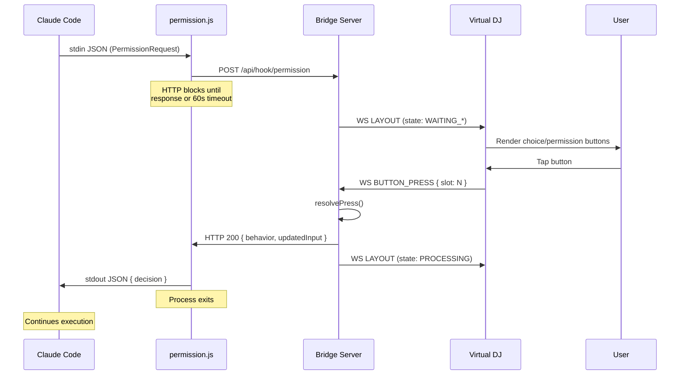
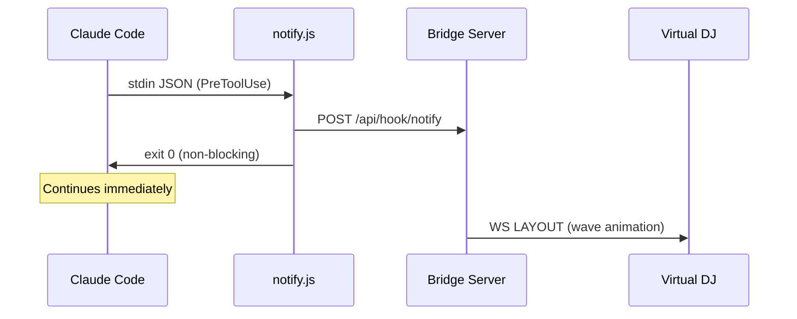

🌐 [English](README.md) | [한국어](README.ko.md) | [中文](README.zh.md)

# Claude DJ

通过物理按钮或浏览器控制 Claude Code — 无需聚焦终端。

**[项目主页](https://whyjp.github.io/claude-dj/)**

## 快速开始

### 1. 安装插件

在 Claude Code 会话中：

```
/plugin marketplace add https://github.com/whyjp/claude-dj
/plugin install claude-dj-plugin
```

此单次安装会自动注册 **hooks + skills**。

| 自动配置项 | 详情 |
|----------------|---------|
| **Hooks (17)** | SessionStart/End, PermissionRequest(blocking), PreToolUse/PostToolUse, PostToolUseFailure, Stop/StopFailure, SubagentStart/Stop, UserPromptSubmit, TaskCreated/Completed, PreCompact/PostCompact, TeammateIdle, Notification |
| **Skills (4)** | choice-format（通过 AskUserQuestion 输出所有选项）, bridge-start, bridge-stop, bridge-restart |

### 2. 启动 Bridge

Bridge 会在会话打开时通过 `SessionStart` hook 自动启动。如需手动启动：

```bash
node bridge/server.js                  # http://localhost:39200
./scripts/start-bridge.sh              # 同上，含自动安装
./scripts/start-bridge.sh --debug      # + 文件日志输出至 logs/bridge.log
```

打开 **http://localhost:39200** 查看 Virtual DJ 控制台。

**Miniview（小窗模式）：** 点击标题栏的 `▣` 按钮，可将 Deck 弹出为始终置顶的迷你窗口。也可直接打开 `http://localhost:39200?view=mini`。

### 3. 使用 Claude Code

```bash
claude                     # hooks + skills 自动加载
```

Claude 现在会通过 Deck 处理所有权限对话框和选项选择，无需聚焦终端。

## 本地开发

开发 claude-dj 本身时，使用 `--plugin-dir` 从本地克隆加载插件，支持实时代码变更：

```bash
git clone https://github.com/whyjp/claude-dj.git
cd claude-dj
npm install

# 手动启动 Bridge
node claude-plugin/bridge/server.js          # 前台运行
./scripts/start-bridge.sh                    # 含自动安装
npm run stop                                 # 停止运行中的 Bridge

# 使用本地插件运行 Claude Code（无需 marketplace 安装）
claude --plugin-dir claude-plugin
```

### Bridge 控制

| 命令 | 说明 |
|---------|-------------|
| `npm start` | 启动 Bridge（前台） |
| `npm run stop` | 停止运行中的 Bridge |
| `npm run debug` | 启动并开启文件日志 |
| `./scripts/start-bridge.sh` | 启动并自动执行 npm install |
| `./scripts/stop-bridge.sh` | 查找并终止 Bridge 进程 |

## 选项处理机制

Claude DJ 将 Claude Code 从纯终端工作流转变为按钮驱动的交互模型。核心创新是**skill 注入选项流水线**，它改变了 Claude 呈现决策的方式以及用户响应的方式。

### 问题所在

默认情况下，Claude Code 在终端中以文本形式呈现选项：

```
Which approach should we take?
1. Refactor the module
2. Rewrite from scratch
3. Patch and move on
```

用户必须找到终端、输入数字并按 Enter。当多个会话同时运行时，这会产生持续的上下文切换开销。

### 解决方案：Skill 注入

Claude DJ 安装了一个 **`choice-format` skill**（`skills/choice-format/SKILL.md`），它会自动加载到每个 Claude Code 会话中。该 skill 在模型层面修改 Claude 的行为：

**之前（默认 Claude）：** Claude 在对话记录中将编号列表以纯文本形式写入。

**之后（应用 skill）：** Claude 在每个决策节点 — 确认、方案选择、参数选择以及工作流中的任何分支点 — 都使用 `AskUserQuestion` 工具。

这不是表面上的变化。`AskUserQuestion` 是 Claude Code 的内置工具，会触发 `PermissionRequest` hook — 与文件写入和 Shell 命令审批使用的相同 hook 系统。通过指示 Claude 将所有选项路由经过此工具，每个决策都成为 Deck 可以渲染为物理按钮的**结构化、可拦截的事件**。

### 选项流水线

```
  Claude Code (model)
       │
       │  Skill injection: "use AskUserQuestion for all choices"
       │
       ▼
  AskUserQuestion tool call
       │  tool_name: "AskUserQuestion"
       │  tool_input: { questions: [{ question, options: [{label, description}] }] }
       │
       ▼
  PermissionRequest hook ──→ hooks/permission.js ──→ POST /api/hook/permission
       │                                                      │
       │  (HTTP request blocks until                          │
       │   deck button is pressed                             ▼
       │   or 60s timeout)                             Bridge Server
       │                                               SessionManager
       │                                                      │
       │                                               state: WAITING_CHOICE
       │                                               prompt: { type: CHOICE, choices }
       │                                                      │
       │                                                      ▼ WebSocket broadcast
       │                                               ┌─────────────┐
       │                                               │  Virtual DJ │
       │                                               │  (browser)  │
       │                                               │             │
       │                                               │ [Refactor]  │
       │                                               │ [Rewrite ]  │
       │                                               │ [Patch   ]  │
       │                                               └──────┬──────┘
       │                                                      │
       │                                               User presses button
       │                                                      │
       │                                                      ▼
       │                                               BUTTON_PRESS { slot: 0 }
       │                                                      │
       │                                               resolvePress → { answer: "1" }
       │                                                      │
       ◀──────────────────────────────────────────────────────┘
       │  HTTP response:
       │  { decision: { behavior: "allow", updatedInput: { answer: "1" } } }
       │
       ▼
  Claude receives answer "1" → continues with "Refactor the module"
```

### Claude 层面的变化

`choice-format` skill 使 Claude 产生三种行为转变：

1. **结构化输出** — 不再使用自由格式的编号列表，Claude 生成带有类型化 `options` 数组的 `AskUserQuestion` 工具调用。每个选项包含 `label`（按钮文本）和 `description`（上下文说明）。

2. **阻塞式交互** — `AskUserQuestion` 触发 `PermissionRequest` hook，这是唯一**阻塞 Claude 执行**直到响应到达的 hook 类型。这创造了真正的暂停等待交互，不同于文本选项——Claude 写完后会立即继续执行。

3. **选择与确认的区分** — skill 区分两种交互模式：

   - **真实选择**（多条真正不同的路径）：2-4 个不同选项，例如 "Refactor" / "Rewrite" / "Patch"
   - **确认**（计划批准）：Claude 以文本陈述其计划，然后用恰好 2 个选项提问："Proceed" / "Different approach"

   这防止了一种常见的反模式——Claude 将计划描述作为选项呈现（例如，选项 1 是"修改 X 并应用 Y"，选项 2 是"同时应用到 Z"）。计划描述不是选项——应以文本陈述，随后跟一个是/否确认。

### 两种选项路径

Claude DJ 支持两种不同的选项机制：

| 路径 | 触发条件 | 状态 | 响应方式 |
|------|---------|-------|-----------------|
| **AskUserQuestion**（主要） | `tool_name: "AskUserQuestion"` 的 `PermissionRequest` hook | `WAITING_CHOICE` | 携带 `updatedInput.answer` 的阻塞 HTTP 响应 |
| **记录解析**（通知） | `Stop` hook 解析最后一条助手消息中的编号列表 | `WAITING_RESPONSE` | 仅展示 — Deck 显示"等待输入"指示器 |

**AskUserQuestion 路径**是主要机制 — 实时、阻塞，并保证响应传递。**记录解析路径**是当 Claude 无视 skill 以文本写入选项时的纯展示通知。Deck 显示"等待输入"指示器告知用户 Claude 在等待，但交互发生在终端中。Stop hook 无法将用户轮次注入回 Claude，因此该路径有意设计为非交互式。

### 跨会话焦点管理

当多个 Claude Code 会话同时运行时：

- **WAITING_CHOICE/BINARY 始终优先** — `getFocusSession()` 优先选择需要按钮输入的会话，而非仅处理中的会话。
- **焦点过滤广播** — 当会话 A 在处理而会话 B 在等待选项时，A 的 `PreToolUse`/`PostToolUse` 事件**不**广播布局更新。B 的选项按钮在 Deck 上保持稳定。
- **权限时自动聚焦** — 任何会话触发 `PermissionRequest` 时，立即获取 Deck 焦点。
- **手动循环** — 槽位 11 在根会话间循环，槽位 12 在聚焦会话内的子代理间循环。

### 子代理追踪

Claude Code 会生成共享父会话 `session_id` 的子代理（Explore、Plan 等）。Claude DJ 通过 `SubagentStart`/`SubagentStop` hook 追踪这些子代理：

```
● api-server (abc123)        PROCESSING
  ├ Explore (agent_7f2a)     PROCESSING
  └ Plan (agent_9c1b)        IDLE
● frontend (def456)          WAITING_CHOICE
```

每个子代理都有独立的状态追踪。来自子代理的权限请求仍使用会话级的 `respondFn`，因此无论请求来自根代理还是子代理，Deck 按钮均可正常工作。

## 架构

### 系统架构图

```
┌──────────────────────────────────────────────────────────────────────┐
│                        Claude Code Process                           │
│                                                                      │
│  Model ──→ Tool Call ──→ Hook System ──→ hooks/*.js (child process)  │
│    ▲                                         │                       │
│    │                                         │ stdin: JSON event     │
│    │                                         │ stdout: JSON response │
│    │                                         ▼                       │
│    │  ◀── stdout (blocking) ───────── permission.js ────────┐       │
│    │  ◀── exit 0 (fire-and-forget) ── notify.js ────────┐   │       │
│    │                                   stop.js ──────┐   │   │       │
│    │                                   postToolUse ──┤   │   │       │
│    │                                   subagent*.js ─┤   │   │       │
│    │                                   userPrompt.js ┤   │   │       │
│    │                                                 │   │   │       │
└────│─────────────────────────────────────────────────│───│───│───────┘
     │                                                 │   │   │
     │    ┌────────── HTTP (localhost:39200) ──────────┘   │   │
     │    │    POST /api/hook/notify (async) ◀────────────┘   │
     │    │    POST /api/hook/permission (BLOCKING) ◀─────────┘
     │    │    POST /api/hook/stop (async)
     │    │    POST /api/hook/subagent* (async)
     │    │    GET  /api/events/:sid (poll)
     │    ▼
     │  ┌──────────────────────────────────────────────────────┐
     │  │              Bridge Server (Express + WS)            │
     │  │                                                      │
     │  │  SessionManager ──→ state machine, focus, prune      │
     │  │  ButtonManager  ──→ state → layout, resolvePress     │
     │  │  WsServer       ──→ broadcast LAYOUT/ALL_DIM         │
     │  │  Logger         ──→ stdout + logs/bridge.log         │
     │  │                                                      │
     │  │  HTTP response = hookSpecificOutput                  │
     │  │  (permission.js blocks until response or 60s timeout)│
     │  └──────────────────────┬───────────────────────────────┘
     │                         │
     │              WebSocket (ws://localhost:39200/ws)
     │              ┌──────────┴──────────┐
     │              ▼                     ▼
     │  ┌───────────────────┐  ┌─────────────────────────┐
     │  │  Virtual DJ       │  │  Ulanzi Translator      │
     │  │  (Browser)        │  │  Plugin (Phase 3)       │
     │  │                   │  │                         │
     │  │  ← LAYOUT (JSON)  │  │  ← LAYOUT → render PNG  │
     │  │  ← ALL_DIM        │  │  ← ALL_DIM              │
     │  │  ← WELCOME        │  │  → BUTTON_PRESS         │
     │  │  → BUTTON_PRESS   │  │                         │
     │  │  → AGENT_FOCUS    │  │  Bridge WS ↔ Ulanzi WS  │
     │  │  → CLIENT_READY   │  └────────────┬────────────┘
     │  │                   │               │
     │  │  Miniview (PiP)   │    WebSocket (ws://127.0.0.1:3906)
     │  └───────────────────┘    Ulanzi SDK JSON protocol
     │                                       │
     │                           ┌───────────▼───────────┐
     │                           │  UlanziStudio App     │
     │                           │  (host, manages D200) │
     │                           └───────────┬───────────┘
     │                                       │ USB HID
     │                           ┌───────────▼───────────┐
     │                           │  Ulanzi D200 Hardware │
     │                           │  13 LCD keys + encoder│
     │                           └───────────────────────┘
     │
     └── HTTP response flows back through permission.js stdout to Claude
```

### 各段协议说明

| 段 | 协议 | 传输 | 方向 | 是否阻塞 |
|---------|----------|-----------|-----------|-----------|
| Claude → Hook | stdin JSON | child process spawn | Claude → Hook script | 取决于 hook 类型 |
| Hook → Bridge | HTTP REST | `fetch()` to localhost | Hook script → Bridge | **PermissionRequest: 是**（阻塞直到按钮/超时） |
| Bridge → Virtual DJ | WebSocket JSON | `ws://localhost:39200/ws` | Bridge → Browser | 否（广播） |
| Virtual DJ → Bridge | WebSocket JSON | 同一连接 | Browser → Bridge | 否（fire-and-forget） |
| Bridge → Ulanzi Plugin | WebSocket JSON | `ws://localhost:39200/ws` | Bridge → Plugin | 否（广播） |
| Ulanzi Plugin → Bridge | WebSocket JSON | 同一连接 | Plugin → Bridge | 否（fire-and-forget） |
| Plugin ↔ UlanziStudio | WebSocket JSON | `ws://127.0.0.1:3906`（Ulanzi SDK） | 双向 | 否 |
| UlanziStudio ↔ D200 | USB HID | proprietary | 双向 | — |
| Bridge → Claude | HTTP response | 与 Hook→Bridge 相同的连接 | Bridge → Hook script → stdout → Claude | 解除阻塞请求 |

### 时序图 — Permission（Blocking）



### 时序图 — Notify（Fire-and-Forget）



**关键路径：** `PermissionRequest` hook 是唯一的**同步**段。hook 脚本（`permission.js`）发出 HTTP POST 并**阻塞**，直到 Bridge 响应（按钮按下）或 60 秒超时。所有其他 hook 均为 fire-and-forget。

**D200 硬件说明：** D200 通过 USB 连接到 UlanziStudio 桌面应用，而不是直接连接到 Bridge。翻译插件（Phase 3）桥接两个 WebSocket 协议。详情请参阅 `docs/todo/d200-integration-architecture.md`。

### 为何需要独立的 Bridge 进程？

Claude Code hook 是**短生命周期的子进程** — 每次 hook 调用都会 spawn `node hooks/permission.js`，运行后写入 stdout 并退出。没有持久进程来保持 WebSocket 连接或会话状态。Bridge 填补了这个空缺：

| 需求 | 仅 Hook | Bridge |
|------|-----------|--------|
| 到 Deck 的持久 WebSocket | 无法实现（每次事件后退出） | 保持连接 |
| 跨事件的会话状态 | 无法实现（无共享内存） | SessionManager |
| 多会话焦点管理 | 无法实现（隔离进程） | getFocusSession() |
| 按钮按下 → HTTP 响应映射 | 无法实现（无监听器） | respondFn callback |

**能做成 MCP 服务器吗？** MCP 将工具从服务器提供给 Claude。Bridge 通过 hook 从 Claude 接收事件 — 数据流方向相反。然而，将 Bridge 包装为 MCP 服务器（含 no-op 工具）可以通过 Claude 插件系统实现**自动启动**。这是潜在的 Phase 2 改进方向。

### 插件系统

```
.claude-plugin/
├─ marketplace.json              发布元数据（git-subdir → claude-plugin/）
claude-plugin/
├─ plugin.json                   插件元数据
├─ hooks/
│  ├─ hooks.json                 17 个 hook 定义（由 Claude Code 自动发现）
│  ├─ sessionStart.js            SessionStart → 自动启动 Bridge + 显示控制台 URL
│  ├─ sessionEnd.js              SessionEnd → 通知 Bridge（async）
│  ├─ boot-bridge.js             Bridge 引导：安装依赖，detached 启动
│  ├─ permission.js              PermissionRequest → HTTP POST（blocking）
│  ├─ notify.js                  PreToolUse → HTTP POST（async）
│  ├─ postToolUse.js             PostToolUse → HTTP POST（async）
│  ├─ postToolUseFailure.js      PostToolUseFailure → HTTP POST（async）
│  ├─ stop.js                    Stop → HTTP POST（async，选项解析）
│  ├─ stopFailure.js             StopFailure → HTTP POST（async）
│  ├─ choiceParser.js            Stop hook 共享的选项解析逻辑
│  ├─ subagentStart.js           SubagentStart → HTTP POST（async）
│  ├─ subagentStop.js            SubagentStop → HTTP POST（async）
│  ├─ userPrompt.js              UserPromptSubmit → GET events（poll）
│  ├─ taskCreated.js             TaskCreated/TaskCompleted → HTTP POST（async）
│  ├─ compact.js                 PreCompact/PostCompact → HTTP POST（async）
│  ├─ teammateIdle.js            TeammateIdle → HTTP POST（async）
│  └─ notification.js            Notification → HTTP POST（async）
└─ skills/
   ├─ choice-format/SKILL.md     注入 Claude："所有选项使用 AskUserQuestion"
   ├─ bridge-start/SKILL.md      手动启动 Bridge
   ├─ bridge-stop/SKILL.md       停止运行中的 Bridge
   └─ bridge-restart/SKILL.md    重启 Bridge（停止 + 启动）
```

## Deck 布局

```
Row 0: [0] [1] [2] [3] [4]       ← Dynamic: choices or approve/deny
Row 1: [5] [6] [7] [8] [9]       ← Dynamic: choices (up to 10 total)
Row 2: [10:count] [11:session] [12:agent] [Info Display]
```

| 状态 | 槽位 0-9 | 槽位 11 | 槽位 12 |
|-------|-----------|---------|---------|
| IDLE | 熄灭 | 会话名称 | ROOT |
| PROCESSING | 波浪脉冲 | 会话名称 | 代理类型或 ROOT |
| WAITING_BINARY | 0=Approve, 1=Always/Deny, 2=Deny | 会话名称 | 代理类型或 ROOT |
| WAITING_CHOICE | 0..N = 选项按钮 | 会话名称 | 代理类型或 ROOT |
| WAITING_CHOICE (multiSelect) | ☐/☑ 切换（0-8）+ ✔ Done（9） | 会话名称 | 代理类型或 ROOT |
| WAITING_RESPONSE | ⏳ 等待输入（仅展示） | 会话名称 | 代理类型或 ROOT |

## 功能特性

- **Skill 注入选项流水线** — Claude 对所有决策使用 `AskUserQuestion`，实现按钮驱动的交互


- **权限按钮** — Approve / Always Allow / Deny 映射到 Deck 槽位


- **多选切换+提交** — `multiSelect` 问题显示 ☐/☑ 切换按钮（槽位 0-8）+ ✔ Done（槽位 9），实时验证
- **跨会话焦点** — WAITING_CHOICE/BINARY 会话自动优先，处理事件被过滤
- **子代理追踪** — 树形视图展示，每个代理独立状态，槽位 12 循环切换
- **等待输入通知** — Claude 以文本选项停止时，Deck 显示 ⏳ 指示器
- **多会话管理** — 槽位 11 循环根会话，权限时自动切换焦点
- **延迟加入同步** — 新客户端立即接收当前 Deck 状态
- **Miniview 模式** — 将 Deck 弹出为始终置顶的 PiP 窗口（`▣` 按钮或 `?view=mini`），含根/子代理切换标签栏
- **插件打包** — 使用可移植 `${CLAUDE_PLUGIN_ROOT}` 路径的 `.claude-plugin/plugin.json`
- **Bridge 自动启动** — SessionStart hook 在未运行时 spawn Bridge，并显示控制台 URL
- **Bridge 版本不匹配自动重启** — 插件更新后检测过时的 Bridge 并使用新版本重启
- **Bridge 斜杠命令** — `/bridge-start`、`/bridge-stop`、`/bridge-restart` skill 用于手动 Bridge 控制
- **Bridge 自动关闭** — 无会话或客户端时 5 分钟后优雅关闭
- **工具错误红色脉冲** — 工具错误（`PostToolUseFailure`、`StopFailure`）在槽位 0-9 显示红色脉冲
- **会话自动清理** — 空闲会话在 5 分钟后被清理
- **智能会话命名** — 从磁盘 PID 文件解析会话名称，索引默认值（`session[0]`、`session[1]`、...）
- **原生权限规则** — hook 响应中的 `updatedPermissions` 用于持久化允许/拒绝规则
- **任务与压缩追踪** — TaskCreated/Completed、PreCompact/PostCompact hook 记录到 Bridge 日志
- **调试日志** — `--debug` 标志启用文件日志，输出到 `logs/bridge.log`，含结构化级别（INFO/WARN/ERROR）

## 配置

| 环境变量 | 默认值 | 说明 |
|---------------------|---------|-------------|
| `CLAUDE_DJ_PORT` | `39200` | Bridge 服务器端口 |
| `CLAUDE_DJ_URL` | `http://localhost:39200` | Hook → Bridge URL |
| `CLAUDE_DJ_BUTTON_TIMEOUT` | `60000`（60 秒） | 权限按钮超时（ms） |
| `CLAUDE_DJ_IDLE_TIMEOUT` | `300000`（5 分钟） | 会话清理超时（ms） |
| `CLAUDE_DJ_SHUTDOWN_TICKS` | `10`（5 分钟） | 自动关闭前的空闲 tick 数（×30 秒） |
| `CLAUDE_DJ_DEBUG` | 关闭 | 设为 `1` 启用文件日志 |

## 调试

```bash
# 启动并开启文件日志
./scripts/start-bridge.sh --debug       # Linux/macOS
scripts\start-bridge.bat --debug        # Windows
npm run debug                           # 通过 npm

# 日志文件位置在启动时输出：
#   [claude-dj] Log file: D:\github\claude-dj\logs\bridge.log

# 仅过滤问题（WARN = dropped/ignored，ERROR = 失败）
grep -E "WARN|ERROR" logs/bridge.log

# 端到端追踪按钮按下
grep "slot=0" logs/bridge.log
```

日志级别：
| 级别 | 含义 | 示例 |
|-------|---------|---------|
| `INFO` | 正常流程 | `[ws] BUTTON_PRESS slot=0`，`[hook→claude] behavior=allow` |
| `WARN` | 按钮被丢弃/忽略 | `[btn] dropped — no focused session`，`TIMEOUT` |
| `ERROR` | 出现异常 | `[hook→claude] FAILED res.json`，`respondFn threw` |

## 开发

```bash
npm install                            # 安装依赖
npm test                               # 运行所有测试（223）
node claude-plugin/bridge/server.js    # 启动 Bridge
npm run debug                          # 启动 Bridge 并开启文件日志
npm run stop                           # 停止运行中的 Bridge
```

## 许可证

MIT
