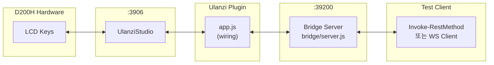
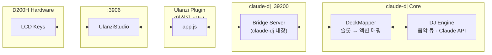
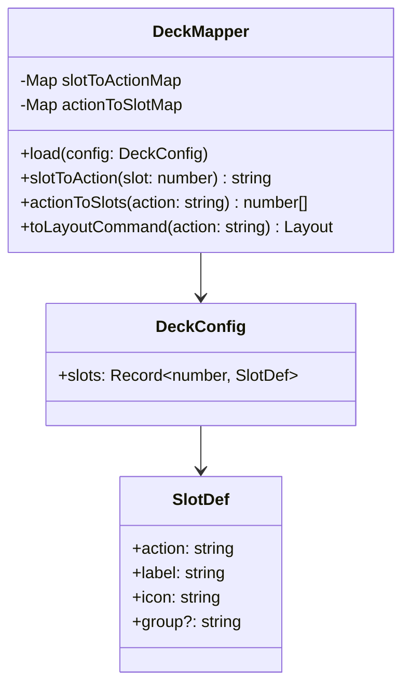

# claude-dj 이식 가이드

d200h-test에서 실기기(D200H) 검증이 완료된 코드를 claude-dj에 이식하는
완전한 절차, 아키텍처 비교, 코드 매핑 레퍼런스.

---

## 실기기 검증 완료 현황

| 스테이지 | 내용                             | 결과        |
| -------- | -------------------------------- | ----------- |
| Stage A  | D200H 버튼 누름 → Bridge 수신    | ✅ 검증완료 |
| Stage B  | 버튼 누름 → LCD 토글 (⚫↔🟢)    | ✅ 검증완료 |
| Stage C  | REST API → LCD 원격 제어         | ✅ 검증완료 |
| Stage D  | Bridge 재시작 → 플러그인 자동 재연결 | ✅ 검증완료 |

검증 환경: Windows 11 · D200H (5열×4행) · UlanziStudio · Node.js v20

---

## 통합 아키텍처 비교

### 현재: d200h-test (독립 테스트 하네스)



### 목표: claude-dj 통합 후



---

## 이식 범위 및 코드 매핑

### 변경 없이 그대로 복사

| d200h-test 파일                             | claude-dj 경로                                            | 이유                   |
| ------------------------------------------- | --------------------------------------------------------- | ---------------------- |
| `plugin/core/eventParser.js`                | `claude-plugin/translator/core/eventParser.js`            | 순수 함수, 의존성 없음 |
| `plugin/core/stateMachine.js`               | `claude-plugin/translator/core/stateMachine.js`           | 순수 함수, 의존성 없음 |
| `plugin/adapters/ulanziInputAdapter.js`     | `claude-plugin/translator/adapters/ulanziInputAdapter.js` | 어댑터, 변경 불필요    |
| `plugin/adapters/ulanziOutputAdapter.js`    | `claude-plugin/translator/adapters/ulanziOutputAdapter.js`| 어댑터, 변경 불필요    |
| `plugin/plugin-common-node/`                | `claude-plugin/translator/plugin-common-node/`            | SDK 래퍼               |
| `bridge/wsServer.js`                        | `bridge/wsServer.js` (이미 존재 시 merge)                 | `terminateAll()` 추가  |
| `resources/idle.png`, `active.png`          | `claude-plugin/translator/resources/`                     | Twemoji 기반 PNG       |

### 확장이 필요한 파일

#### `plugin/core/layoutMapper.js` — preset 추가

d200h-test의 `mapLayout`은 `idle` / `active` / `custom` preset만 지원한다.
claude-dj는 다음 preset을 추가해야 한다:

```javascript
// claude-dj용 layoutMapper.js 추가 케이스
export const PRESETS = {
  IDLE:       'idle',
  ACTIVE:     'active',
  PROCESSING: 'processing',   // Claude API 응답 대기
  BINARY:     'binary',       // Yes/No 선택
  CHOICE:     'choice',       // 다중 선택지
};

// mapLayout() switch 확장
case 'processing':
  return allSlots(0).map(cmd => ({ ...cmd, text: '...' }));

case 'binary':
  return [
    { slot: layout.slot ?? 0, stateIndex: 2, text: 'Yes' },
    { slot: (layout.slot ?? 0) + 1, stateIndex: 3, text: 'No' },
  ];

case 'choice':
  return (layout.choices ?? []).slice(0, 10).map((c, i) => ({
    slot: i,
    stateIndex: 4,
    text: (c.label ?? '').slice(0, 12),
  }));
```

#### `plugin/app.js` — 진입점

```javascript
// d200h-test: 단순 WS 이벤트 전달
// claude-dj: DeckMapper를 통해 슬롯 ↔ 액션 변환 후 DJ Engine으로 라우팅

// 변경 포인트 — onButtonPress 콜백
ws.onButtonPress = (slot, context) => {
  const action = deckMapper.slotToAction(slot); // 추가
  djEngine.dispatch(action);                     // 추가
  bridge.sendButtonPress(slot, context);         // 기존 유지
};
```

#### `bridge/server.js` — 추가 라우팅

```javascript
// 추가 REST 엔드포인트
app.post('/api/prompt', async (req, res) => {
  const { text } = req.body;
  wsServer.broadcast({ type: 'LAYOUT', preset: 'processing' });
  const result = await claudeApi.send(text);
  wsServer.broadcast({ type: 'LAYOUT', preset: 'idle' });
  res.json({ ok: true, result });
});
```

### `manifest.json` States 확장

현재 d200h-test의 states (2개):

```json
"States": [
  { "Name": "IDLE",   "Image": "resources/idle.png"   },
  { "Name": "ACTIVE", "Image": "resources/active.png" }
]
```

claude-dj 확장 (5개):

```json
"States": [
  { "Name": "IDLE",       "Image": "resources/idle.png"       },
  { "Name": "ACTIVE",     "Image": "resources/active.png"     },
  { "Name": "APPROVE",    "Image": "resources/approve.png"    },
  { "Name": "DENY",       "Image": "resources/deny.png"       },
  { "Name": "CHOICE",     "Image": "resources/choice.png"     }
]
```

> `ulanziOutputAdapter.js`는 `setBaseDataIcon(context, base64, text)` 방식을 사용하므로
> manifest States는 UI 표시용 메타데이터일 뿐이다. 실제 렌더링은 base64 PNG로 직접 주입된다.

---

## 슬롯 ↔ 액션 매핑 설계 (DeckMapper)

claude-dj에서 새로 구현할 `DeckMapper` 클래스의 인터페이스 설계 예시:



설정 파일 예시 (`deck.config.json`):

```json
{
  "slots": {
    "0":  { "action": "play",       "label": "▶",    "icon": "active" },
    "1":  { "action": "pause",      "label": "⏸",    "icon": "idle"   },
    "5":  { "action": "next-track", "label": "⏭",    "icon": "active" },
    "10": { "action": "ask-claude", "label": "AI",    "icon": "active" },
    "20": { "action": "stop-all",   "label": "■",    "icon": "deny"   }
  }
}
```

---

## 이식 절차 (단계별)

### 1단계: pre-example 폴더 복사

```powershell
# claude-dj 프로젝트 루트에서
cp -r path/to/d200h-test claude-plugin/pre-example
```

### 2단계: Translator 플러그인 패키지 생성

```
claude-dj/
└── claude-plugin/
    ├── pre-example/          ← d200h-test 전체 복사본 (레퍼런스)
    └── translator/           ← 신규 플러그인 (pre-example에서 이식)
        ├── manifest.json     ← UUID: com.claudedj.deck
        ├── resources/        ← idle/active/approve/deny/choice PNG
        └── plugin/
            ├── app.js
            ├── plugin-common-node/
            ├── core/
            │   ├── eventParser.js     (복사)
            │   ├── stateMachine.js    (복사)
            │   └── layoutMapper.js    (확장)
            └── adapters/
                ├── bridgeWsAdapter.js (복사)
                └── ulanziOutputAdapter.js (복사)
```

### 3단계: manifest.json UUID 변경

```json
{
  "UUID": "com.claudedj.deck",
  "Name": "claude-dj Deck",
  "Category": "Music",
  "Actions": [
    {
      "UUID": "com.claudedj.deck.slot",
      ...
    }
  ]
}
```

### 4단계: Bridge WS URL 확인

```javascript
// d200h-test와 동일 포트 사용 가능
const bridge = new BridgeWsAdapter({
  url: process.env.BRIDGE_URL ?? 'ws://localhost:39200/ws',
});
```

### 5단계: 테스트 이식

```powershell
# import 경로만 수정하여 복사
cp pre-example/test/eventParser.test.js   test/translator/eventParser.test.js
cp pre-example/test/stateMachine.test.js  test/translator/stateMachine.test.js
cp pre-example/test/layoutMapper.test.js  test/translator/layoutMapper.test.js
cp pre-example/test/integration.test.js   test/translator/integration.test.js
```

각 파일의 import 경로를 `../../claude-plugin/translator/...`로 수정.

```powershell
node --test test/translator/*.test.js
# 74 pass, 0 fail
```

### 6단계: UlanziStudio 플러그인 설치

```powershell
$src  = "claude-dj/claude-plugin/translator"
$dest = "$env:APPDATA\Ulanzi\UlanziDeck\Plugins\com.claudedj.deck.ulanziPlugin"
cp -r $src $dest
```

UlanziStudio 재시작 → Plugins 목록에 "claude-dj Deck" 확인.

---

## 포트 할당 레퍼런스

| 포트  | 용도                                     | 변경 가능 여부  |
| ----- | ---------------------------------------- | --------------- |
| 3906  | UlanziStudio ↔ Plugin (SDK 고정)         | ❌ 변경 불가    |
| 39200 | Bridge Server (Plugin ↔ External App)    | ✅ env 변수로   |
| 39297 | Integration Test — WsServer              | ✅ 테스트 전용  |
| 39298 | Integration Test — BridgeWsAdapter 테스트 | ✅ 테스트 전용  |
| 39299 | Integration Test — 재연결 시나리오       | ✅ 테스트 전용  |

---

## D200H 슬롯 배치 (실기기 검증 완료)

```
      col0  col1  col2  col3  col4
       ┌────┬────┬────┬────┬────┐
 row0  │  0 │  5 │ 10 │ 15 │ 20 │  ← 20 = 우측 최상단 (검증됨)
       ├────┼────┼────┼────┼────┤
 row1  │  1 │  6 │ 11 │ 16 │ 21 │  ← 11 = key:"2_1" (검증됨)
       ├────┼────┼────┼────┼────┤
 row2  │  2 │  7 │ 12 │ 17 │ 22 │
       ├────┼────┼────┼────┼────┤
 row3  │  3 │  8 │ 13 │ 18 │ 23 │
       └────┴────┴────┴────┴────┘

slot = physical_col × 5 + physical_row
```

---

## 아키텍처 원칙 (이식 후에도 유지)

1. `core/`는 순수 함수. WS·파일·로거 import 금지.
2. `adapters/`는 외부 의존을 생성자 주입으로만 받는다.
3. 테스트 실패 시: 테스트 로직 오류인지 원본 API 오류인지 먼저 구분한다.
4. Green 상태를 억지로 만드는 수정 금지 — 반드시 시나리오가 의미 있어야 한다.

---

## 회귀 보장 체크리스트

- [ ] `pre-example/` (d200h-test) `npm test` 74개 통과 유지
- [ ] `test/translator/*.test.js` 74개 통과
- [ ] `layoutMapper.test.js`에 신규 preset (binary, choice, processing) 단위 테스트 추가
- [ ] 실기기(D200H) + claude-dj Bridge 통합 테스트
- [ ] Stage D (재연결) 동일 통과
- [ ] DeckMapper 단위 테스트 추가
