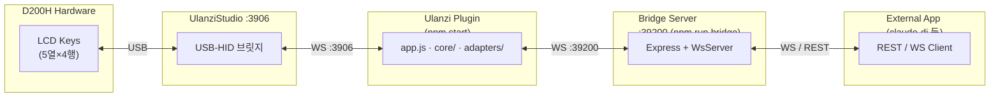

# d200h-test Documentation

Ulanzi D200H 하드웨어 연동 테스트 하네스.
실기기(D200H) 검증을 완료한 코드베이스로, `claude-dj`의 `pre-example`로 사용된다.

---

## 문서 목록

| 문서                                          | 내용                                                   |
| --------------------------------------------- | ------------------------------------------------------ |
| [Architecture](architecture.md)               | 시스템 구조, 클래스/시퀀스 Mermaid 다이어그램          |
| [Component Reference](components.md)          | 각 모듈의 역할, API, 타입 명세                         |
| [Bridge Protocol](bridge-protocol.md)         | WebSocket 메시지 포맷 및 REST API 명세                 |
| [Testing](testing.md)                         | 테스트 구조, 실행 방법, 커버리지 현황                  |
| [TROUBLESHOOTING.md](../TROUBLESHOOTING.md)   | 실환경 연동에서 발견한 문제와 해결 기록                |
| [PORTING.md](../PORTING.md)                   | claude-dj 이식 가이드 (아키텍처 비교·코드 매핑 포함)   |

---

## 시스템 개요



---

## Quick Start

### 필요 조건

-   Node.js v20+
-   UlanziStudio 설치 (실기기 사용 시)
-   D200H 장치 연결

### 설치

```powershell
cd d200h-test
npm install
```

### 실행 (터미널 2개)

```powershell
# 터미널 1 — Bridge 서버
npm run bridge
# [bridge] server started at ws://localhost:39200/ws

# 터미널 2 — Ulanzi 플러그인
npm start
# [bridge-plugin] starting — UUID=com.d200htest.bridge
# [bridge-plugin] connected to UlanziStudio
```

UlanziStudio에서 "Bridge Slot" 액션을 D200H 키에 배치하면
`key added` 로그가 출력되고 버튼 입력이 활성화된다.

### 테스트

```powershell
npm test
# 74 pass  0 fail
```

---

## Project Structure

```
d200h-test/
├── bridge/
│   ├── server.js              # Bridge HTTP + WebSocket 서버
│   └── wsServer.js            # WsServer 클래스 (terminateAll 포함)
│
├── com.d200htest.bridge.ulanziPlugin/
│   ├── manifest.json          # UUID: com.d200htest.bridge
│   ├── resources/
│   │   ├── idle.png           # ⚫ Twemoji 검정 원 (IDLE 상태)
│   │   └── active.png         # 🟢 Twemoji 초록 원 (ACTIVE 상태)
│   └── plugin/
│       ├── app.js             # 플러그인 진입점 (wiring)
│       ├── core/
│       │   ├── eventParser.js      # WS msg → InputEvent DTO
│       │   ├── stateMachine.js     # IDLE ↔ ACTIVE 전이
│       │   └── layoutMapper.js     # LAYOUT → SlotCommand[]
│       ├── adapters/
│       │   ├── bridgeWsAdapter.js  # Bridge WS 연결 + 재연결
│       │   └── ulanziOutputAdapter.js  # setBaseDataIcon → LCD
│       └── plugin-common-node/    # UlanziDeckPlugin-SDK 래퍼
│
├── test/
│   ├── eventParser.test.js    # parseSlot "row_col" 포맷 포함
│   ├── stateMachine.test.js
│   ├── layoutMapper.test.js   # TOTAL_SLOTS=25, slot=20 포함
│   └── integration.test.js    # WsServer + BridgeWsAdapter 통합
│
├── docs/                      # 이 디렉토리
├── TROUBLESHOOTING.md         # TBL-001 ~ TBL-005 실환경 문제 기록
├── PORTING.md                 # claude-dj 이식 가이드
└── package.json
```

---

## 실기기 검증 결과 (Stage A~D)

| 스테이지 | 내용                                  | 결과        |
| -------- | ------------------------------------- | ----------- |
| Stage A  | D200H 버튼 누름 → Bridge 수신         | ✅ 검증완료 |
| Stage B  | 버튼 누름 → LCD 토글 (⚫↔🟢)         | ✅ 검증완료 |
| Stage C  | REST `POST /api/layout` → LCD 제어    | ✅ 검증완료 |
| Stage D  | Bridge 재시작 → 플러그인 자동 재연결  | ✅ 검증완료 |

검증 환경: Windows 11 · D200H (5열×4행) · UlanziStudio · Node.js v20

---

## D200H Slot Layout (실측)

```
      col0  col1  col2  col3  col4
       ┌────┬────┬────┬────┬────┐
 row0  │  0 │  5 │ 10 │ 15 │ 20 │  ← 20 = 우측 최상단 (검증됨)
       ├────┼────┼────┼────┼────┤
 row1  │  1 │  6 │ 11 │ 16 │ 21 │  ← 11 = key:"2_1" (검증됨)
       ├────┼────┼────┼────┼────┤
 row2  │  2 │  7 │ 12 │ 17 │ 22 │
       ├────┼────┼────┼────┼────┤
 row3  │  3 │  8 │ 13 │ 18 │ 23 │
       └────┴────┴────┴────┴────┘

slot = physical_col × 5 + physical_row
```

---

## Key Design Decisions

### Bridge 서버가 중간에 있는 이유

UlanziStudio(포트 3906)에 외부 앱이 직접 연결하는 것은 SDK 구조상 불가능하다.
플러그인만 UlanziStudio에 연결할 수 있으므로,
플러그인이 Bridge를 통해 외부 앱과 통신하는 구조가 필요하다.

### core를 순수 함수로 유지하는 이유

-   외부 의존성 없이 독립적으로 단위 테스트 가능
-   `claude-dj` 등 다른 프로젝트로 복사만으로 이식 가능
-   버그 발생 시 계층을 분리해 원인 파악이 쉬움

### `setBaseDataIcon` vs `setStateIcon`

실기기에서 `setStateIcon`은 manifest 기반 이미지 캐시 문제로 LCD가 업데이트되지 않는다.
`setBaseDataIcon(context, base64PNG, text)`을 사용해 직접 PNG 데이터를 주입한다.
→ `TROUBLESHOOTING.md` TBL-005 참조

### key 포맷 (`"row_col"`)

실제 UlanziStudio는 버튼 위치를 `"0_0"` 형식으로 전달한다.
시뮬레이터는 `"0"` (단순 정수)을 사용해 개발 중 차이가 노출되지 않는다.
`parseSlot`이 두 포맷을 모두 지원한다. → `TROUBLESHOOTING.md` TBL-001

---

## claude-dj로 이식하기

이 폴더 전체를 `claude-dj/claude-plugin/pre-example/`로 복사한 후
[PORTING.md](../PORTING.md)의 절차를 따른다.

**핵심 변경 사항:**

1.  `layoutMapper.js`에 `binary`, `choice`, `processing` preset 추가
2.  `manifest.json` UUID를 `com.claudedj.deck`으로 변경
3.  `resources/`에 approve/deny/choice PNG 추가
4.  `DeckMapper` 클래스를 신규 구현 (슬롯 ↔ 액션 매핑)
5.  `app.js` `onButtonPress`를 claude-dj DJ Engine으로 라우팅

변경 없이 그대로 복사 가능한 파일:
`eventParser.js`, `stateMachine.js`, `ulanziInputAdapter.js`,
`ulanziOutputAdapter.js`, `bridgeWsAdapter.js`, `plugin-common-node/`
