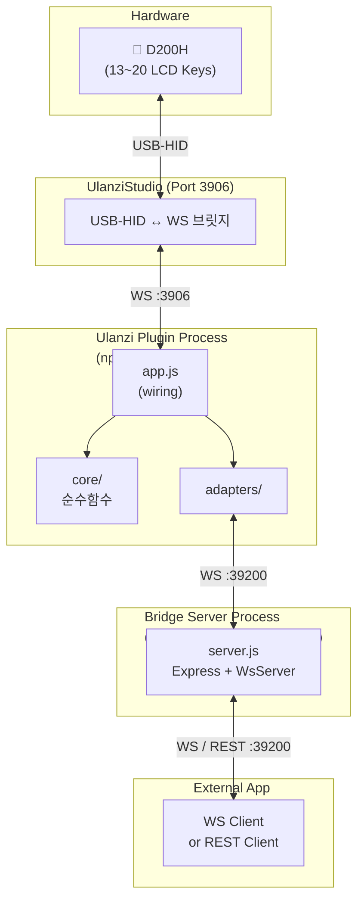
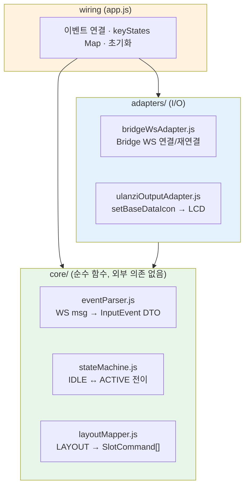
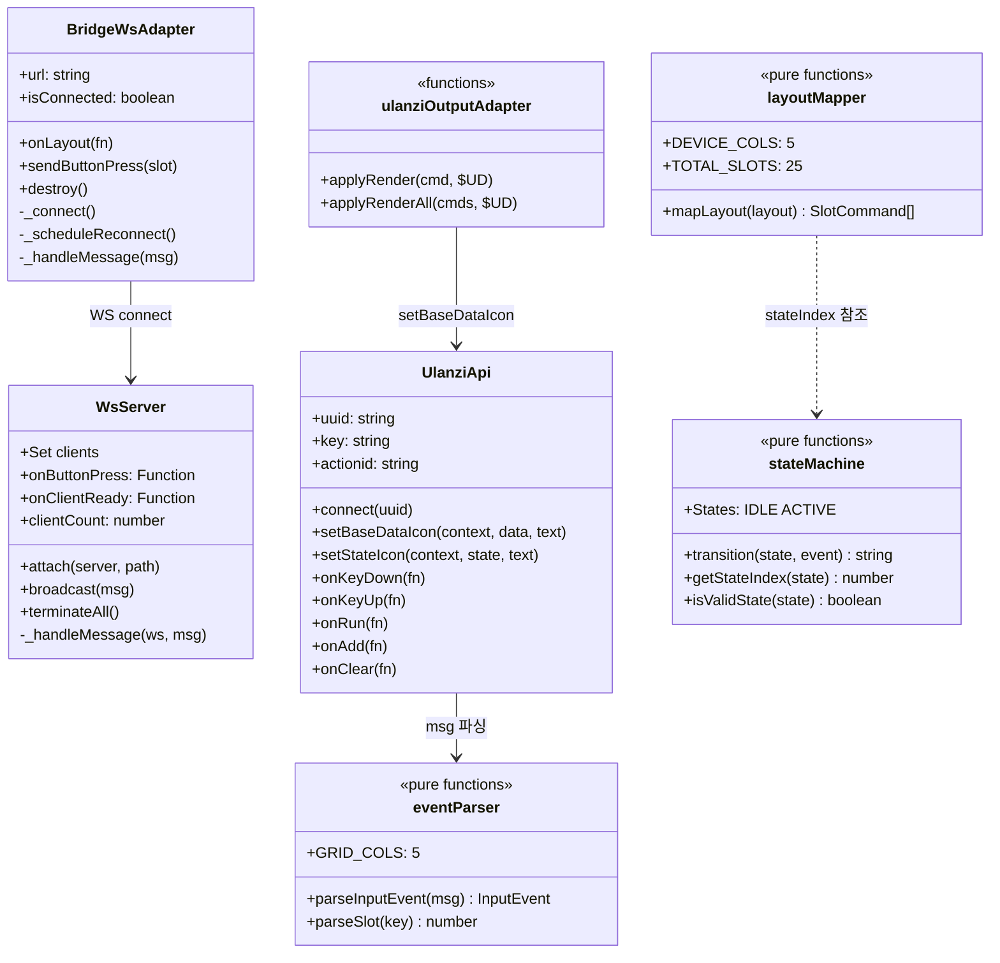
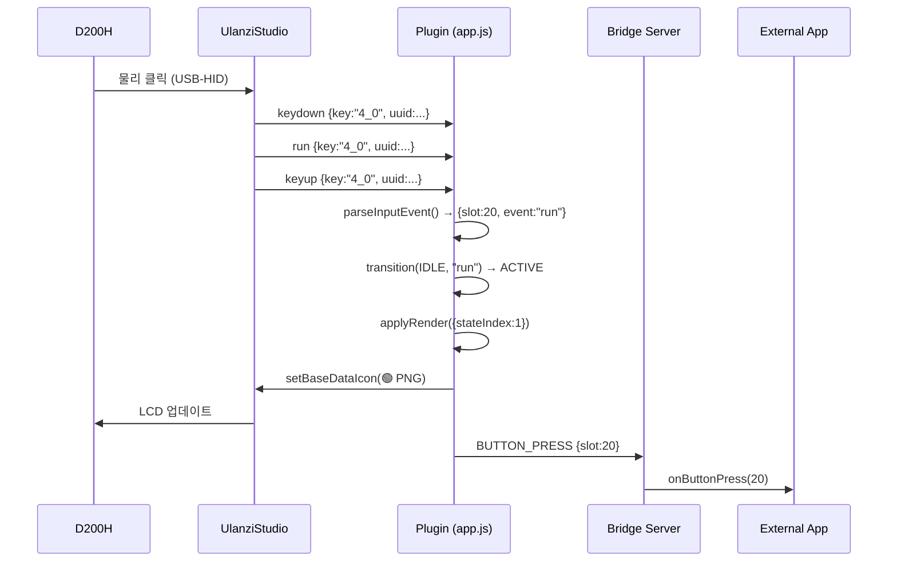
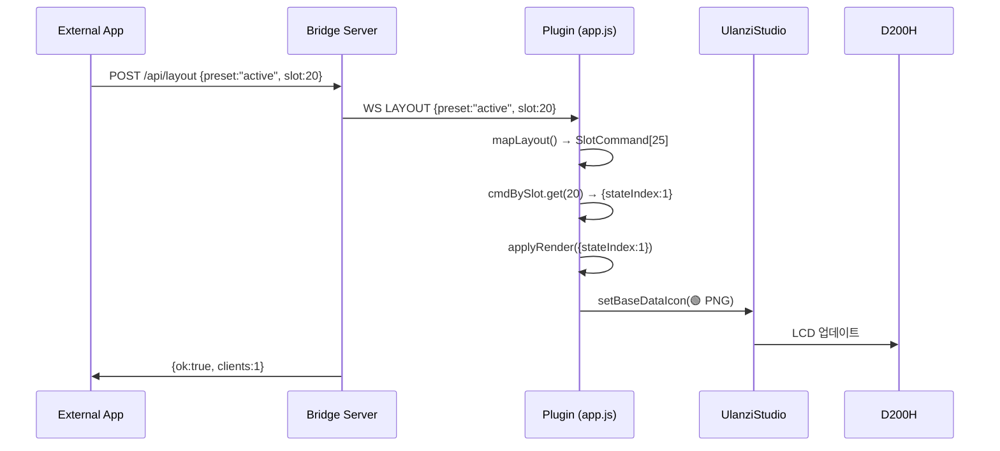
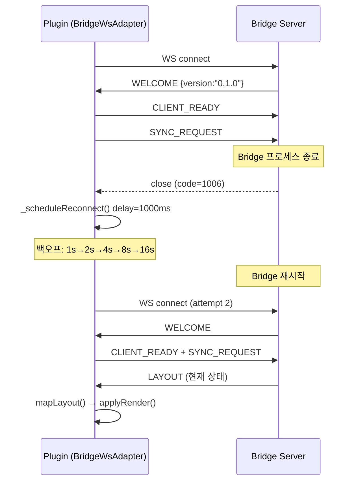
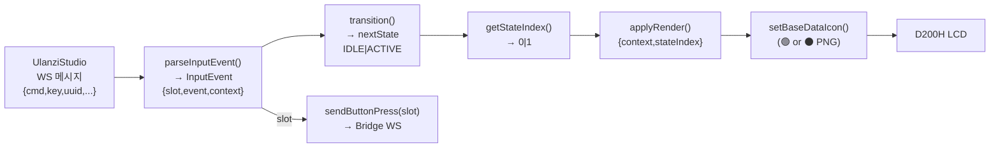

# Architecture

## System Overview



## Layer Design

플러그인 내부는 세 계층으로 분리된다. 각 계층은 단방향으로만 의존한다.



**핵심 원칙:** `core/`는 순수 함수만 포함. `import`가 없어도 테스트 가능.

## Class Diagram



## Sequence Diagrams

### 버튼 누름 — D200H → Bridge



### 레이아웃 변경 — External App → D200H



### 재연결 (Stage D)



## D200H Physical Key Layout

UlanziStudio가 전달하는 key 포맷: **`"physical_col_physical_row"`**

```
      col0  col1  col2  col3  col4
       ┌────┬────┬────┬────┬────┐
 row0  │  0 │  5 │ 10 │ 15 │ 20 │  ← 우측 최상단 = slot 20
       ├────┼────┼────┼────┼────┤
 row1  │  1 │  6 │ 11 │ 16 │ 21 │
       ├────┼────┼────┼────┼────┤
 row2  │  2 │  7 │ 12 │ 17 │ 22 │
       ├────┼────┼────┼────┼────┤
 row3  │  3 │  8 │ 13 │ 18 │ 23 │
       └────┴────┴────┴────┴────┘

slot = physical_col × DEVICE_COLS(5) + physical_row
```

| key 문자열 | physical_col | physical_row | slot |
| ---------- | ------------ | ------------ | ---- |
| `"0_0"`    | 0            | 0            | 0    |
| `"2_1"`    | 2            | 1            | 11   |
| `"4_0"`    | 4            | 0            | 20   |
| `"4_3"`    | 4            | 3            | 23   |

> **주의:** UlanziDeckSimulator는 `"0"`, `"1"` 단순 정수를 사용한다.
> 실제 UlanziStudio는 `"col_row"` 포맷을 사용한다. → `TROUBLESHOOTING.md` TBL-001

## Data Flow


